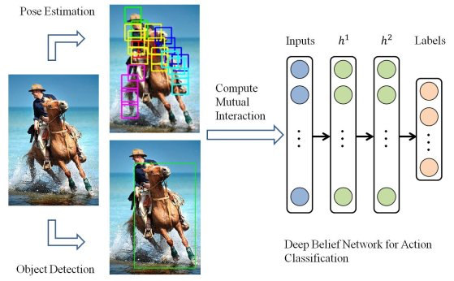
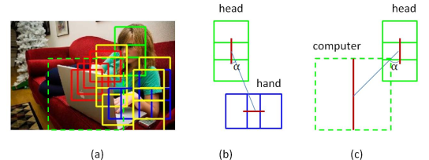
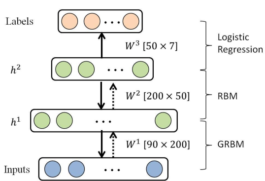

# AN EXPRESSIVE DEEP MODEL FOR HUMAN ACTION PARSING FROM A SINGLE IMAGE
[pdf](./DBN.pdf)  
关键字: **Deep Belief Net**


## Q1. 论文针对的问题？
### A1. human action recognition

## Q2. 文章要验证的假设是什么？
### A2. 在周围物体的帮助下，从静止图像中识别人的动作

## Q3. 有哪些相关研究？如何归类？
### A3. 略

## Q4. 文章的解决方案是什么？关键点是什么？
### A4. 如下
  
(1) 利用body part和object的检测结果构造成对信息, 实现上下文信息的使用  
  
```
[isExist; x1; y1; x2; y2; α]
其中: 
(1) isExist: body part/object和head之间是否存在interaction(文中没有具体说head是不是指head box, 猜测这里的interaction是交集);
(2) x1; y1; x2; y2: part/object中心线的坐标(相对于头部中心);
(3) α: part/object中心线和head中心线之间的夹角;

ps. 文中没有提到中心线是如何定义的, 只提到body part检测方法来自于Human re-identification by matching compositional template with cluster sampling, object检测方法使用的是DPM.
```
(2) 使用10个body parts和5个object构成15x6=90的输入, 训练一个DBN(Deep Belief Net)  

```
DBN是一个概率生成模型。与传统的判别模型相对，生成模型建立一个数据样本和标签之间的联合分布，对P(Sample|Label)和 P(Label|Sample)都做了估计，而判别模型仅仅而已估计了P(Label|Sample)。
DBN由多层RBM(受限玻尔兹曼机, 全连接层是双向的)组成的
```

## Q5. 评估数据集是什么？评估方法是什么？
### A5. 如下
* 数据集: Willow Action dataset, 427张训练, 484张测试
* 评估指标: mAP

## Q6. 文章的实验是怎么设计的？
### A6. 对比试验, 消融实验(不加object部分)

## Q7. 实验方法和结果能不能支持文章提出的假设？
### A7. 文章过于早, 只在Willow上做了测试, 说服力比较弱

## Q8. 文章的主要贡献是什么？
### A8. 略

## Q9. 是否存在不足或者问题？
### A9. 一些个人的想法
(1) 输入里只用到了坐标位置, 没有用到类别(body part和object的类别都没用到), 是15*6=90的15个排列顺序变相提供了信息?  


## Q10. 下一步还可以继续的研究方向是什么？  
### A10. 略