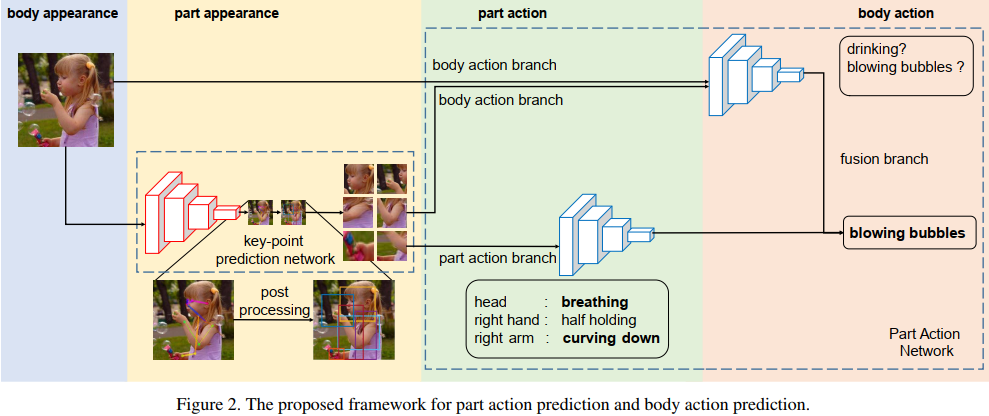
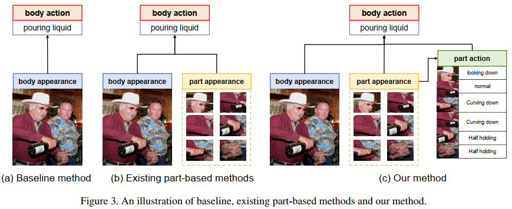

# Single Image Action Recognition using Semantic Body Part Actions (2017, ICCV, 清华大学)
*注意该文章有两个版本*
[pdf](./Single%20image%20action%20recognition%20using%20semantic%20body%20part%20actions.pdf)   
[code](https://github.com/ZhichenZhao/part-action-network)

## Q1. 论文针对的问题？
### A1. Single Image Action Recognition using

## Q2. 文章要验证的假设是什么？
### A2. 人的行为不仅仅是原始身体部位和空间关系的结合, 而是人体局部的语义行为和上下文信息的结合。在没有监督的情况下，局部人体的appearance和整体人体动作的联系性不够强烈.

## Q3. 有哪些相关研究？如何归类？
### A3. 
1. Single image action recognition:  
   * context-based: cues from interactive objects(应该是指HoI)
   * part-based: 大多数现有的part-based方法是给part赋予具有action标签, 然后作分类。 
   * template-based: focus on action structures(e.g. 将poses和interactive objects视为叶节点，并对它们的关系进行建模).   

## Q4. 文章的解决方案是什么？关键点是什么？
### A4. 整个人体动作不仅是身体部位的直接组合，还存在着一种mid-level的语义信息(局部动作)。它们与整个人体的action类别高度相关。例如，“cooking”与局部动作“hand: cutting”密切相关;(但在没有手部动作的情况下, 通过环境-厨房、着装-围裙也可以推断出cooking, 所以单从局部动作推断人类意图是不够的)
#### 4.1. From body parts to semantic part actions
1. 定义了五个身体部分：头、躯干、手臂、腿和手;
2. 定义了它们的语义动作。如图3所示，每个身体部位都有一个相对简单的动作。例如，头部可以是“笑”、“看穿”、“抬头”等。   
    
3. 因为没有现成的标签, 对Stanford-40的训练集进行标注。

#### 4.2. Body part localization: 检测part 
1. semi-FCN: 不作上采样, 只在低分辨率下预测part的分割图(例如, 当输入为512x512时预测图为16x16);
2. Dataset and Training: 
   * PASCAL Part: PASCAL VOC2010的一组附加标签, 定义了所有20个类别中的part标签(像素级分割标签)。这里只使用包含人物的图像, 并通过最近邻算法将gt调整为16×16网格;  
   * MPII: 人体关键点标注。将每个像素标记为其最邻近的关键点类别, 然后调整大小。  

***在第二个版本的论文中，作者抛弃了上述方式(甚至根本没提), 改用关键点预测网络(在COCO上训练好的PAFnet)来定位part, 论文中有从点到框的描述***

#### 4.3. Part and body actions prediction
1. Baseline Network: Resnet50, 整图和人体抠图是作为两个不同输入来提取特征的(没有用RoI pooling);  
2. Part-based Network: 所有part都被调整为224×224并输入网络。多个部分（七个黄色块）的特征通过fc层转换为单个特征。变换后的单个特征(fp)由整体的动作类别来监督。连接fbbox、fw和fp，并使用连接的分类器输出最终分数, 黄色分支学习从part到action的映射关系;  
3. Part Action Network: 增加分支学习每个part的part action类别(绿色), 然后使用fc层将特征转换为全身动作特征(fa)。转换之前和之后的特征分别受到part action和action的监督。融合分支连接4种特征。在测试阶段，part分支和融合分支(图7中的两个实心框softmax)的得分取平均值，形成最终得分;

## Q5. 评估数据集是什么？评估方法是什么？
### A5.  
* 数据集: PASCAL VOC 2012、Standford-40
* 评价指标: mAP  

## Q6. 文章的实验是怎么设计的？
### A6. 
#### 6.1 分析实验
1. part actions和body actions的关联性  

   
#### 6.2 对比试验
  

  
## Q7. 实验方法和结果能不能支持文章提出的假设？
### A7. 

## Q8. 文章的主要贡献是什么？
### A8. 

## Q9. 是否存在不足或者问题？
### A9. 

## Q10. 下一步还可以继续的研究方向是什么？  
### A10. 