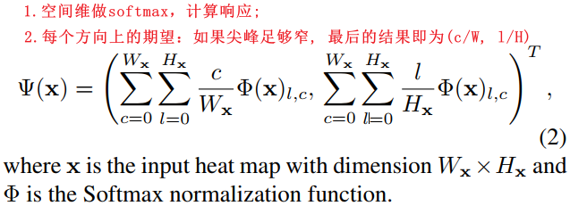

# 2D/3D Pose Estimation and Action Recognition using Multitask Deep Learning(CVPR 2018)
[pdf](./2D3D%20Pose%20Estimation%20and%20Action%20Recognition%20using%20Multitask%20Deep%20Learning.pdf), [paper](https://openaccess.thecvf.com/content_cvpr_2018/papers/Luvizon_2D3D_Pose_Estimation_CVPR_2018_paper.pdf), [offical code](https://github.com/dluvizon/deephar), [code](https://github.com/pminhtam/2D-3D_Multitask_Deep_Learning)

## Q1. 论文针对的问题？
### A1. 论文针对的问题: 2D/3D的人体姿态估计(2D/3D的人体关键点检测)和2D/3D的动作识别; 

## Q2. 文章要验证的假设是什么？
### A2. 假设点:   
(1) Pose Estimation和Action Recognition两者相互关联, 不是distinct tasks;  
(2) deep learning有能力实现两个任务之间的端到端训练(Pose常作为Action Recognition的先验);  
(3) 多任务联合训练会提升彼此的效果。

## Q3. 有哪些相关研究？如何归类？
### A3. 相关研究领域:  
(1) 2D Pose Estimation: detection based (predict a heat map and need argmax as a post-processing step) and regression based methods (predict the joint coordinates, but is frequently sub-optimal);  
(2) 3D Pose Estimation: learn precise 3D representations from RGB images;   
(3) 2D action recognition: based on videos, 2D means images data. methods: classical methods, 3D convolutions, attention models that focus on body parts, two-stream networks;  
(4) 3D action recognition: based on skeleton data. methods: Spatio-Temporal LSTM;

## Q4. 文章的解决方案是什么？关键点是什么？
### A4. 联合训练  
#### 1. Human pose estimation
1. *regression-based approach:  use Soft-argmax to ensure model is differentiable and allow end-to-end optimization.*   
  
(1) The Soft-argmax layer: 最大值可以通过输入的期望来计算, 如果尖峰足够窄, 期望就接近于最大后验(MAP)估计。   
   
(2) Joint visibility: 每个关节点的可见性得分通过Sigmoid计算(最大值位置, 由(1)计算);  

2. *Unified 2D/3D pose estimation*  
(1) volumetric representations: 堆叠N个2D heat_map;  
(2) 对Z轴平均以计算(x, y), 对X-Y面平均以计算z;  
(3) 训练时可以使用2D和3D数据混合训练, 对于2D数据仅对(x, y)分支做反传.    
  

#### 2. Human action recognition
1. *Pose-based branch*  
(1) 堆叠T个frame的N个关键点坐标形成TxNx2或TxNx3的input map;    
(2) 堆叠K个prediction blocks;    

2. *Appearance-based branch*  
(1) pose estimation的heat_map和feature map相乘并在空间维度求和, 得到特征NxC。堆叠T个frame的特征形成TxNxC的input;  
(2) 结构和Pose-based branch相同;   
  
3. *Action aggregation*
联合两个branch的输出, 全连接+softmax

## Q5. 评估数据集是什么？评估方法是什么？是否有什么需要补充的？
### A5. 评估方式如下:
1. 2D pose estimation  
(1) 数据集: MPII  
(2) 指标: [PCKh](https://zhuanlan.zhihu.com/p/270619106), [AUC](https://blog.csdn.net/fisherming/article/details/97616368)  
2. 2D pose estimation  
(1) 数据集: Human3.6M  
(2) 指标: [MPJPE](https://blog.csdn.net/leviopku/article/details/118108885)   
3. 2D action recognition  
(1) 数据集: Penn Action dataset  
(2) 指标: acc 
4. 3D action recognition  
(1) 数据集: NTU  
(2) 指标: acc 

## Q6. 文章的实验是怎么设计的？是否存在不足或者问题？
### A6. 如下
#### 1. 对比实验和消融实验
(1) 对比实验: 在2D/3D human pose estimation和2D/3D human action recognition上和已有方法对比;  
(2) 消融实验(只在har上做): estimated pose比Kinect poses更好; 端到端fine-tuning比分开训练好; Pose-based branch和Appearance-based branch互补;

#### 2. 一些问题  
(1) 3D action recognition实验中对于提出方法, 不使用estimated poses是指不使用pose-based branch预测吗?   
(2) 设计Multi-clip的意义是什么?  
(3) 没有在2D action recognition实验中做消融实验;

## Q7. 实验方法和结果能不能支持文章提出的假设？
### A7. 能

## Q8. 文章的主要贡献是什么？
### A8. 提出基于detect的可微分的pose estimation方法, 证明pose estimation和action recognition进行端到端训练可以提升action recognition精度;

## Q9. 下一步还可以继续的研究方向是什么？  
### A9. 无