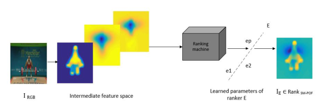
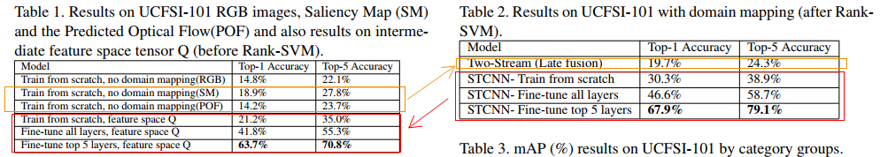
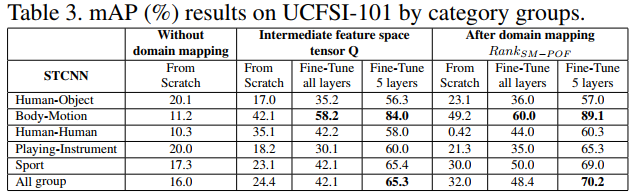
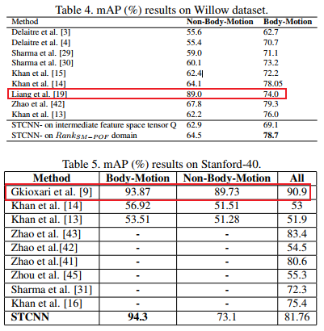
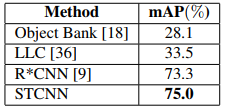
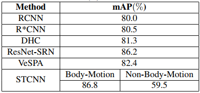

# Still Image Action Recognition by Predicting Spatial-Temporal Pixel Evolution
[pdf](./Still%20Image%20Action%20Recognition%20by%20Predicting%20Spatial-Temporal%20Pixel%20Evolution.pdf)

## Q1. 论文针对的问题，是否是一个新问题？
### A1. 静态图像行为识别。否。

## Q2. 文章要验证的假设是什么？
### A2. 结合显著性图和预测光流图给静态图带来更好的时空特征表示

## Q3. 有哪些相关研究？如何归类？
### A3. 
* 基于低级特征, 例如SIFT和HOG
* 基于高级线索进行分类，例如(1)属性, (2)身体部位和姿势, (3)人-对象交互;

## Q4. 文章的解决方案是什么？关键点是什么？
### A4. STCNN: 空间显著性图(SM)+预测光流(POF), 迁移学习  
#### 1. 域变换:
(1) 利用现有方法计算空间显著性图, 起到对图像信息降维去噪、关注有效信息的作用;  
(2) 利用现有方法预测光流图, 增加时间运动信息;  
(3) 空间显著性图+x方向光流图+y方向光流图构成新的图像Q;  
(4) 通过RankSVM将Q变换到SM−POF域, 得到IE。  

#### 2. 迁移学习
(1) ImageNet预训练的VGG16;
(2) 固定底层, 微调高层, 后在目标数据集上从头开始训练新的分类器层FC8;

## Q5. 评估数据集是什么？评估方法是什么？
### A5. 
#### 1. 数据集
UCFSI-101(基于UCF101抽帧的),  Willow, Stanford-40, WIDER, BU101, Google and iStockPhoto(私有数据集)  
按照Human-Object Interaction, Body_Motion, Human-Human interaction, Playing Instruments, Sports来对动作分类
#### 2. 评估指标
acc(top-1和top-5), mAP

## Q6. 文章的实验是怎么设计的？
### A6. 
#### 1. 不同的数据类型在UCFSI-101上的对比(tabel1, table2)
在RGB、SM、POF、Q、IE这4种数据类型上进行对比, 以及是否迁移学习、微调部分层还是全部参数;  
#### 2. 融合方式
STCNN属于early fusion, 文中分别使用CNN实现了SM和POF的分类, 后期融合结合了每个流的softmax分数(相比于单独的流, top-1提升, top-5降低)  

#### 3. UCFSI-101整体和每个动作大类的mAP
微调网络的最后5层可以提高所有动作类别的性能。在所有组中，Body-Motion组中结果最好, 作者认为该类动作严重依赖于预测的身体运动，也是身体最显著的部分，而和人物交互无关。  

#### 4. 在Willow、Stanford-40上和现有方法的对比(分成Body-Motion和Non-Body-Motion两种)
(1) 在Body-Motion组中效果最好, 在Non-Body-Motion组中效果一般;  
(2) 综合来看在Willow上DBN效果更好, 在Stanford-40上R*CNN更好;  

#### 5. 在Google/iStockPhoto上的效果
#### 6. 在Google/iStockPhoto上和现有方法的对比: Object Bank, LLC, R*CNN

#### 7. 在WIDER上和现有方法的对比: RCNN, R*CNN, DHC, ResNet-SRN, VeSPA

#### 8. 在BU101上的效果

## Q7. 实验方法和结果能不能支持文章提出的假设？
### A7. 

## Q8. 文章的主要贡献是什么？
### A8. (1) 针对不同类型的动作进行分类讨论; (2) 尝试在静态图中引入动态信息;

## Q9. 是否存在不足或者问题？
### A9. 
(1) 实验7中没有对比现有方法在body-motion和non-body-motion的mAP;  
(2) 实验4,5,6中每个实验的对比方法基本都不太一样;    

## Q10. 下一步还可以继续的研究方向是什么？  
### A10. 