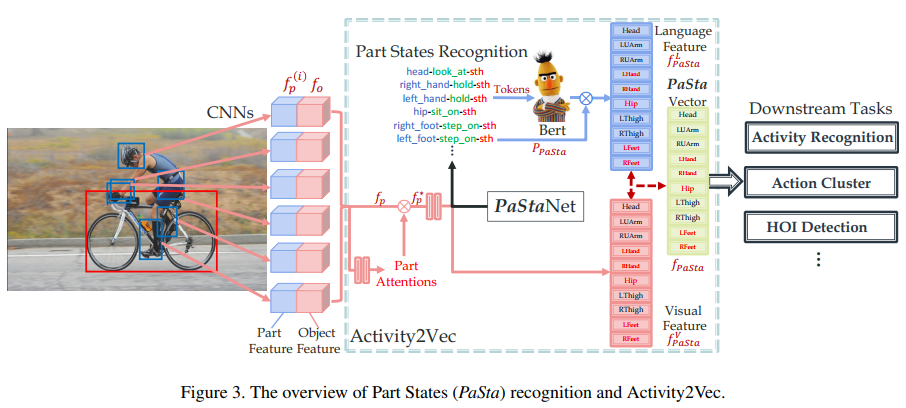

# PaStaNet: Toward Human Activity Knowledge Engine (2020, CVPR, 上海交大)
[pdf](./Pastanet.pdf)   
[paper with code](https://paperswithcode.com/paper/pastanet-toward-human-activity-knowledge)

## Q1. 论文针对的问题？
### A1. HoI

## Q2. 文章要验证的假设是什么？
### A2. 
1. 之前的方法大多基于实例级别的特征或知识（human, object）出发去学习action，但是对于human-object interaction这种复杂的行为，仅靠这种粗粒度的知识是不够的，且训练出来的模型常因不同数据集的action种类设定不同而很难泛化(domain gap)  
2. 首先推断人的部件状态(Body Part State, 以下简称PaSta), 然后根据部件级语义推理出acton类别;  


## Q3. 有哪些相关研究？如何归类？
### A3. 
(1) Activity Understanding    
(2) Human-Object Interaction  
(3) Body Part based Methods  
(4) Part States


## Q4. 文章的解决方案是什么？关键点是什么？
### A4. 
#### 4.1. ***PaStaNet***
1. PaSta Definition: 分解人体为10个part, 给每个part标注状态, 即PaSta;
   ```
   1. 十个部分: 头部、两个上臂、两只手、髋、两个大腿和两只脚;
   2. PaSta: “手”的PaSta可以是“hold something”或“push something”, “头”的PaSta可以是“watch something”, “eat something”;
   3. 一个人可能同时有多个动作，因此每个部分也可能有多个PaSta;
   ```
2. Data Collection: crowdsourcing以人类为中心的图像(30K, 粗略的标签)以及现有精心设计的数据集(185K), 最后收集了超过20w张不同activity类别的图像。  
3. Activity Labeling: 主要是人类日常行为以及一些常见的HOI行为，最终选择了11.8w图片以及 156类HOI标签(详见[PaSta Definition](Pasta%20definition.png))。    
4. Body Part Box: 先进行姿态估计，再通过姿态结果获取human parts.
   ```
   1. 这部分手动调整过，为了提高精度;
   2. 每个box以关节为中心，通过neck和pelvis之间的距离来归一化。置信度高于0.7的关节可视为可见。当不能检测到所有关节时，使用body knowledge-based rules。如果颈部或骨盆不可见，根据其他可见关节组(head, main body, arms, legs)配置box. 例如，如果只有上身可见，将hand box的大小设置为瞳孔距离的两倍。
   ```
5. PaSta Annotation：标注body part states
   ```
   1. 根据前文的156类行为以及WordNet，选择200个动词，如手部state包括hold、pick，头部state包括eat、talk to;
   2. 为了寻找对迁移学习帮助最大的人体状态, 找了150人来标注1万张图片的详细PaSta;
   3. 根据标注结果，通过NPMI方法(Normalized Point-wise Mutual Information)来计算行为以及PaSta的co-occurrence。选择76个NPMI得分高的PaSta;
   4. 通过上面1万张图片的标注结果作为引子，自动生成其他图片的PaSta标签，让其他210个标注者对自动生成的结果进行改进;
   5. 考虑到一个人可能有多个动作，对于每个动作，分别注释其对应的十个PaSta, 然后将所有动作的PaSta集合起来。因此，一个部分也可以有多个状态, 例如，在“eating while talking”的动作中，头部的PaSta为<head; eat; something>, <head; talk to; something>, <head; look at; something>;
   6. 为了确保质量，每个图像注释两次，并由自动程序和监督人员检查。对所有标签进行聚类并丢弃异常值以获得可靠、一致的标注。
   ```
     

6. Coverage Experiment: 验证现有的标签能涵盖大部分类别。  
7. Recognition Experiment: 验证PaSta可以很好的被预测（毕竟模型迁移的时候，就是需要预测PaSta）。
最终，获得11.8万图片，28.5万人物bbox，25万物体bbox，72.4万行为标签，7百万PaSta标签。

#### 4.2. ***Activity Representation by PaStaNet*** 
1. Part State Recognition
   * COCO预训练的Faster RCNN作为encoder, concatenate part feature以及object feature作为输入;  
   * 计算Part relevance represents作加权(即Part Attentions, 判断一个part和act之间的是否有关联性, maxpooling+fc)
   ```
   Part relevance represents how important a body part is to the action. For example, feet usually have weak correlations with “drink with cup”. And in “eat apple”, only hands and head are essential.(这里描述的整体的动作) 
   These relevance/attention labels can be converted from PaSta labels directly, i.e. the attention label will be one, unless its PaSta label is “no action”, which means this part contributes nothing to the action inference.(这里用的part state标注作标签?)
   ```  
   * 加权后f再和object feature拼接, 经过maxpooling+2*fc作PaSta的多分类任务;

2. Activity2Vec: 将PaSta信息转换为特征，以便后续的应用(比如行为识别/HOI)
   * Visual PaSta feature: Part State Recognition最后一层fc的特征(channels=512);  
   * Language PaSta feature: 
   ```
   方式1: 将单个PaSta分解为<part; verb; object>的词组, 每个词经过Bert得到一个768维向量, 拼接成2304维向量。然后将向量和Part State Recognition预测出的score(概率)相乘，得到最终的特征表示;
   方式2: 将单个PaSta改写成一段话送到Bert中;
   ```
   * PaSta Representation: 拼接Language PaSta feature(pool and resize)和Visual PaSta feature得到每个body part的4096维特征  

   
#### 4.3. ***PaSta-based Activity Reasoning*** 
  


## Q5. 评估数据集是什么？评估方法是什么？
### A5.  
* 数据集: MNIST-Action, HICO, HICO-DET, V-COCO, AVA, HICO-DET 
* 评价指标: mAP  

## Q6. 文章的实验是怎么设计的？
### A6. 
#### 6.1 MNIST-Action

* 从0到9（28×28×1）随机抽样MNIST数字，并生成由3到5个数字组成的128×128×1图像。
* 每个图像的标签，为其中两个最大数字的总和（0到18）。
* 假设“PaSta活动”类体部似于“数字总和”。身位可以被视为数字，人类视为所有数字的联合体;(这个假设真的正确吗?)
* 对于实例级模型，将数字框的ROI pooling特征输入到MLP中。
* 对于分层模型，先识别单个数字，然后拼接并集框和digit features, 并将其输入MLP（早期融合），或使用后期融合来组合两个级别的分数。
* 早期融合的精度达到43.7，与实例级方法(10.0)相比优势显著。而后期融合的精度更达到了44.2。此外，仅不进行融合的part级方法也获得了41.4的精度。
* 综上, part-level representation是有效的。   

   
#### 6.2 Image-based Activity Recognition: HICO
1. train step
   * pre-train Activity2Vec with PaSta labels
   * fine-tune Activity2Vec and PaSta-R together on HICO train set.
   ```
   预训练数据分为三种:
   1. PaStaNet*(38K)：HICO train及其PaSta标签。与传统方式相比，这里唯一的额外监督是PaSta注释。
   2. GT PaStaNet*(38K)：数据与PaStaNet*相同。但是使用PaSta的Ground truth作为Activity2Vec的PaSta预测概率。
   3. PaStaNet(118K)：使用所有带有PaSta标签的PaStaNet图像, HICO测试数据除外。
   ```
   * 使用图像级PaSta标签训练Activity2Vec。每个图像级PaSta标签是图像中所有人员的所有PaSta的集合。对于PaSta识别，计算每个part的PaSta类别的mAP, 并计算所有部分的平均mAP. 
   * batchsize=16, 初始学习率为1e-5, momentum=0.9, 余弦衰减的SGD优化器(第一个衰减步骤是5000)。预训练迭代80K次，微调迭代20K次。图像级PaSta和HOI预测都是通过3个人和4个对象的多实例学习（MIL）生成的。

2. results  
  

#### 6.2 Instance-based Activity Detection: HICO-Det
1. train step  
   1. 使用每个带有相应PaSta标记的人体框，来训练Activty2Vec，并在HICO-DET上一起微调Activity2Vec和PaSta-R;
   2. object detection 来自于iCAN或TiN(backbone为ResNet-50); 
   3. 初始学习率为1e-3, momentum=0.9, 余弦衰减的SGD优化器(第一个衰减步骤是80K), 预训练和微调分别需要1M和2M次迭代。
   4. 正负样本比例为1:4;
2. result  
     

#### 6.3 Transfer Learning with Activity2Vec
1. train step  
   1. 使用PaStaNet预训练Activity2Vec和PaSta-R;
   2. 冻结Activity2Vec, 微调PaSta-R;  
2. result  
     
     

#### 6.4 Ablation Study  
*TIN+PaSta\*-Linear在HICO-DET上作消融实验* 
1. 无Part Attention会降低0.21mAP;
2. 分别将Activity2Vec中的PaSta-Bert特征替换为：高斯噪声、Word2Vec和GloVe, 结果均较差(20.80、21.95、22.01mAP);
3. 将<part, verb, sth>描述成句子, 达到最好的mAP(22.26);  


## Q7. 实验方法和结果能不能支持文章提出的假设？
### A7. 

## Q8. 文章的主要贡献是什么？
### A8. 
(1) PaStaNet: 带有细粒度PaSta标注的大规模数据集。
(2) 提出了一种新的提取part级活动表示的方法Activity2Vec和一种PaSta-based的推理方法。
(3) 在监督学习和迁移学习中, 显著的提升baseline，例如在HICO和HICO-DET上分别实现了6.4%(16%)、5.6%(33%)的mAP改进。

## Q9. 是否存在不足或者问题？
### A9. 


## Q10. 下一步还可以继续的研究方向是什么？  
### A10. 