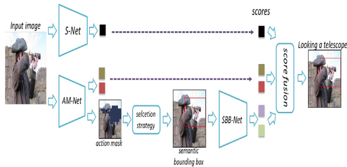
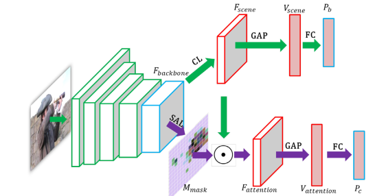
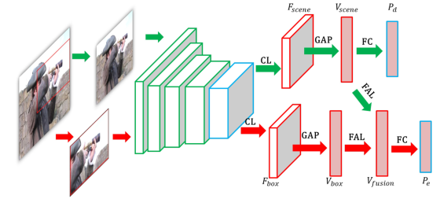

# Spatial attention based visual semantic learning for action recognition in still images
[pdf](./Spatial%20attention%20based%20visual%20semantic%20learning%20for%20action%20recognition%20in%20still%20images.pdf)

## Q1. 论文针对的问题，是否是一个新问题？
### A1. 静态图像动作识别，否

## Q2. 文章要验证的假设是什么？
### A2. 使用空间注意力机制, 避免human box和human body box的标注成本和噪声

## Q3. 有哪些相关研究？如何归类？
### A3. Action recognition, Attention models for image classification
(1) Action recognition: pose methods, human-object interaction methods, scene methods, attention methods;  
(2) Attention models for image classification: hard attention models and soft attention models

## Q4. 文章的解决方案是什么？关键点是什么？
### A4. SAAM-Nets


#### 4.1 S-Net: Classification of the whole scene  
ResNet50 + CL(1*1 conv, 用于降维) + GAP + FC

#### 4.2 AM-Net: Action-specific semantic parts detection
* scene branch(上分支): 和S-Net一致
* attention branch(下分支): 1*1卷积降维到channel=1， 形成空间Mask
* cross-entropy loss function  


#### 4.3 Semantic bounding box generation
* 拆分image为WxH个region。根据Mask的值排序, 得到前49个region(Mask是32倍下采样的, 每个像素对应原图的32x32区域)  
* step1: 取前8的region计算外接矩形;
* step2: 对全部49个region计算连通域, 计算外接矩形Bc;
* step3: 取step2中外接矩形与step1中外界矩形具有最大IOU的那个Ba;
* step4: semantic bounding box为Bc和Ba中size更大的那个。  


#### 4.4 SBB-net: Efficient feature combination
* scene branch(上分支): 和S-Net一致, 使用整图作为输入
* box branch(下分支): 使用semantic bounding box区域作为输入;
* feature attention layer(FAL)=FC-relu-FC-sigmoid为特征注意力。
* cross-entropy loss function
```
V_fusion = V_scene*FAL(V_scene) + V_box*FAL(V_box)
```


#### 4.5 Final prediction
对S-Net, AM-Net and SBB-Net输出的scores进行加权计算最终的score, 权重通过5折交叉验证得到。
```
P_final = W_a*P_a + W_b*P_b + W_c*P_c + W_d*P_d + W_e*P_e
```

## Q5. 评估数据集是什么？评估方法是什么？
### A5. 
(1) 数据集: Stanford40, PASCAL VOC 2012, Willow, MPII
(2) 评估方法: 空间Mask可视化、semantic bounding box可视化、mAP

## Q6. 文章的实验是怎么设计的？
### A6. 消融实验、对比实验
#### 6.1 消融实验:
* 空间注意力层的影响: 空间Mask可视化、空间Mask遮蔽原图对S-Net精度的影响、semantic bounding box可视化
* CL层中卷积核数量的影响: 不同数量对S-Net精度的影响
* 预测score的权重: 不同数量对S-Net精度的影响
* 不同net的表现

#### 6.2 对比试验  
    
  

## Q7. 实验方法和结果能不能支持文章提出的假设？
### A7. 

## Q8. 文章的主要贡献是什么？
### A8. 

## Q9. 是否存在不足或者问题？
### A9. 


## Q10. 下一步还可以继续的研究方向是什么？  
### A10. 