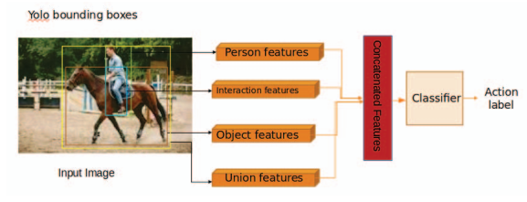
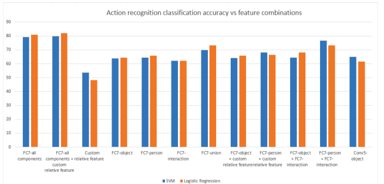

# Understanding action recognition in still images(CVPR 2020)
[pdf](./Understanding%20action%20recognition%20in%20still%20images.pdf)

## Q1. 论文针对的问题，是否是一个新问题？
### A1. 静态图像中的动作识别, 针对人物交互式行为。不是新问题。

## Q2. 文章要验证的假设是什么？
### A2. 把action根据semantics拆分成不同的components。 研究每个components在动作识别中的重要性。

## Q3. 有哪些相关研究？如何归类？
### A3. human body based, body parts based, action-related objects, human object interaction, and the whole scene or context

## Q4. 文章的解决方案是什么？关键点是什么？
### A4. 把一个action拆分成person region, object region, union region和interaction region  


## Q5. 评估数据集是什么？评估方法是什么？是否有什么需要补充的？
### A5. 
#### 1. 数据集
从Stanford 40 and Willow dataset中筛选的数据集, 包括 drinking, fixing, phoning, pouring, reading, riding, sitting and sleeping的8个动作, 总共只有200张图。
#### 2. 指标  
acc

## Q6. 文章的实验是怎么设计的？是否存在不足或者问题？
### A6. 实验设计  
(1) 通过YOLOv2获得人和物的检测框;  
(2) 计算person box和object box的交集(interaction region)和并集(union region);  
(3) 通过AlexNet(imagenet预训练模型)获得每个区域的特征: FC7-object, FC7-person, FC7-interaction, FC7-union  
(4) 计算自定义的interaction feature (Custom interaction feature, 36维的向量):   
```
custom feature = [interaction(person, object), interaction (person, object-person intersection region), interaction(object, object-person intersection region)]
其中: Interaction(c1, c2) = [area(c1), area(c2), area(c1), area(c2), distance(c1, c2), angle feature(c1, c2)] // angle feature(c1, c2): 360度平均拆分成8个bins, 形成1*8的one-hot编码
``` 
(5) 使用SVM和sigmoid分别对Custom interaction feature, FC7-object, FC7-person, FC7-interaction, FC7-union及其组合进行分类。  

## Q7. 实验方法和结果能不能支持文章提出的假设？
### A7. 个人觉得不能。理由如下：
(1) 数据量仅有200张, 不具有代表性;  
(2) 类别只有8种, 并且都是近距离交互行为, 不具有代表性;  
(3) 考虑到文章发表时间(2020年), 仅在AlexNet上实验不具有普遍性;  
(4) 文章中提到只使用YOLOv2的检测框而不使用类别, 目的是让模型不关注具体的object类别而是关注obeject的共性信息, 但是使用的AlexNet是在imagenet上预训练的, 模型本身是否就具备了分类的能力?  
```
Using object category information will focus on co-occurrence rather than specific object properties. For example, we do not want to encode that if there is a couch and a person or a chair and a person in the image the action being performed is sitting. Instead, we would like to encode that an there is an object with a flat surface and a person interacting in a specific way, therefore the action being performed is sitting.
```
(5) Custom interaction feature直接拼接在FC7-object, FC7-person, FC7-interaction, FC7-union上真的可行吗?  
(6) 没有和已有的方法进行比较, 无法说明使用这些region是有用的。

## Q8. 文章的主要贡献是什么？
### A8. 无

## Q9. 下一步还可以继续的研究方向是什么？  
### A9. 无