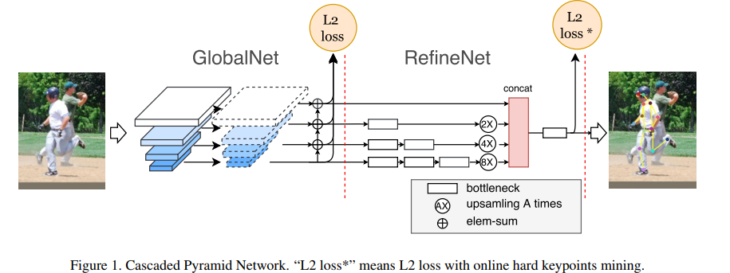
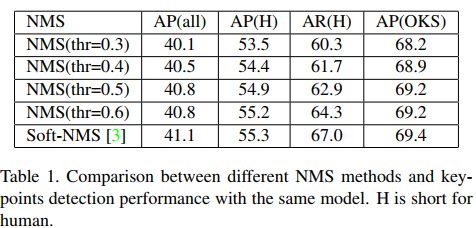

# Cascaded Pyramid Network for Multi-Person Pose Estimation (2018, CVPR, face++)
[pdf](./CPN.pdf)   
[paper with code](https://paperswithcode.com/paper/cascaded-pyramid-network-for-multi-person)

## Q1. 论文针对的问题？
### A1. 人体姿态估计

## Q2. 文章要验证的假设是什么？
### A2. 通过two stages的GlobalNet和RefineNet, 识别“hard”关键点(被遮挡的关键点、不可见的关键点)
(1) 只通过表层特征不能识别这些“难点”，例如：躯干点;  
(2) 在训练过程中没有明确解决这些“难点”的检测问题.

## Q3. 有哪些相关研究？如何归类？
### A3. 
(1) 经典方法: 主要采用图结构或图模型。更具体地说，经典著作[1，34，13，33，8，44，29，20]将人类关键点估计问题表述为树结构或图模型问题，并基于人工特征预测关键点位置。    
(2) CNN的方法: 分为单人姿势估计和多人姿势估计，前者基于给定边界框的裁剪图像预测人体关键点，后者需要进一步识别一幅图像中所有人的全身姿势;

## Q4. 文章的解决方案是什么？关键点是什么？
### A4. Cascaded Pyramid Network
#### 4.1. Human Detector   
基于FPN的SOTA检测模型(RoIAlign替换RoIPooling), 在COCO上训练人体检测;

#### 4.2. CPN  

1. GlobalNet: Resnet + FPN  
基于ResNet主干的GlobalNet可以有效地定位眼睛等关键点，但可能无法精确定位臀部的位置。髋关节等关键点的定位通常需要更多的上下文信息，而不是附近的feature(要求的感受野更大?)。类似存在许多情况，很难通过单个GlobalNet直接识别这些“难”关键点。
2. RefineNet: unsample_concatenate + OHKM(Online Hard Keypoints Mining, 根据loss在线选择难样本点);  

## Q5. 评估数据集是什么？评估方法是什么？
### A5.  
* 数据集: COCO(在COCO trainval上训练, COCO minival上验证, COCO test-dev和test-challenge上测试)    
* 评价指标: OKS(the object keypoint similarity, 根据预测点和真实点之间的距离计算, 点坐标经过人体框大小归一化)  

## Q6. 文章的实验是怎么设计的？
### A6. 
#### 6.1 pose estimation对比、消融实验
***仅在所有COCO train2017数据集（包括57K张图像和150K个人实例）上进行了训练，没有涉及额外的数据，在val2017集合上研究了消融，最后在test-dev2017集合上与最先进的结果进行比较***
1. train step  
(1) 扩展人体框到规定的宽高比(256: 192), crop;  
(2) 数据增强: 缩放(0.7~1.35)、旋转(±45度)和翻转;  
(3) resnet使用ImageNet预训练参数, 试验了resnet50, resnet101, resnet152;  
(4) Adam优化器, 基础学习率5e-4, 每36w步学习率降低2倍, weight-decay=1e-5, batchsize=32。

2. test step  
(1) 为了最小化预测的方差，在预测的热图上应用高斯滤波器;  
(2) 平均原始图像和flip图像的预测作为最终结果, 使用从最高响应到第二最高响应的方向上的四分之一偏移来获得关键点的最终位置;  
(3) box得分和所有关键点的平均得分的乘积被认为是一个人实例的最终姿势得分;  

3. 消融实验  
   (1) Person Detector对关键点检测的影响: 
   * NMS strategies: 参考原始的硬NMS，当阈值增加时，关键点检测的性能提高，这主要是由于box的平均精度(AP)和平均召回率(AR)的提高。由于pose的最终得分部分取决于边界框的得分，因此本应生成更适当得分的软NMS[3]在性能上更好。  
     
   * Detection Performance: 随着检测框的AP(前3列)增加，关键点检测AP(OKS)的增益越来越小.   
      

    (2) Cascaded Pyramid Network  
    * 在COCO val2017上和8-stages Hourglass、ResNet-50 with dilation对比：
      
    * Design Choices of RefineNet:
      
    * FPN feature选取:   
    

    (3) Online Hard Keypoints Mining：
    * 难关键点数的影响:  
    
    * OHKM在GlobalNet和RefineNet上的影响:  
    

    (4) Data Pre-processing
    * Input Size  
    
  
4. 对比实验  
     
   
     
   
## Q7. 实验方法和结果能不能支持文章提出的假设？
### A7. 

## Q8. 文章的主要贡献是什么？
### A8. 

## Q9. 是否存在不足或者问题？
### A9. 没有具体说OHKM的流程

## Q10. 下一步还可以继续的研究方向是什么？  
### A10. 