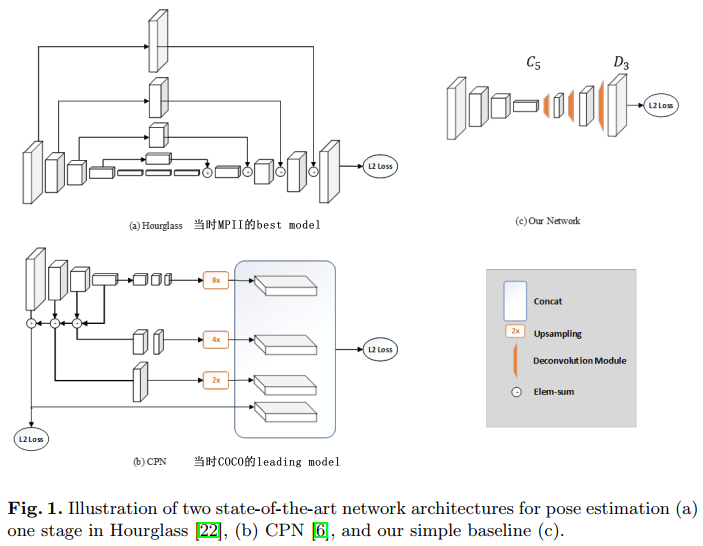
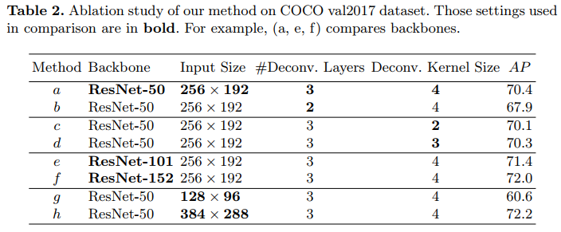

# Simple Baselines for Human Pose Estimation (2018, ECCV, MSRA)
[pdf](./Simple%20Baselines%20for%20Human%20Pose%20Estimation.pdf)   
[paper with code](https://paperswithcode.com/paper/simple-baselines-for-human-pose-estimation)

## Q1. 论文针对的问题？
### A1. 人体姿态估计

## Q2. 文章要验证的假设是什么？
### A2. 
人体姿态估计在深度学习里的发展取得了很大成功，但是网络结构和实验实践变得越来越复杂。当时的MPII和COCO上的领先方法在许多细节上有相当大的差异，但在精度上有很小的差异。很难说哪些细节至关重要, 导致对于算法的分析和比较越来越困难。所以作者希望提出了一个简单但是很有效的baseline网络，用来鼓励大家在这个基础之上进行创新同时使用这个baseline方法来判断新方法的表现。

## Q3. 有哪些相关研究？如何归类？
### A3. 无

## Q4. 文章的解决方案是什么？关键点是什么？
### A4. 
#### 4.1. Pose Estimation Using A Deconvolution Head Network   
*从深度和低分辨率特征生成热图的最简单方法, 并且在最先进的Mask R-CNN中也采用了这种结构*   
(1) backbone: ResNet; 理由：用于图像特征提取的最常见的骨干网络, [24,6]中也使用它进行姿态估计;  
(2) deconvolution head: 在ResNet的最后一个卷积阶段(称为C5)上添加一些反卷积层(transposed conv);  
(3) loss: Mean Squared Error (MSE, 均方误差)。目标热图通过2D高斯分布生成(以关键点位置为中心的二维高斯概率图); 
```
默认情况下，反卷积层数为3, 每个反卷积层kernel=4x4, stride=2, channel=256, 具有BN和ReLU激活, 最后添加1×1卷积层以生成所有k个关键点的预测热图
```
***与Hourglass和CPN相比, SimpleBalines更简单地将上采样和卷积参数组合到反卷积层中，而不使用skip连接。***


#### 4.2. Pose Tracking Based on Optical Flow(略)
(1) Joint Propagation using Optical Flow;  
(2) Flow-based Pose Similarity;  
(3) Flow-based Pose Tracking Algorithm;  


## Q5. 评估数据集是什么？评估方法是什么？
### A5.  
(1) pose estimation
* 数据集: COCO    
* 评价指标: OKS(the object keypoint similarity, 根据预测点和真实点之间的距离计算, 点坐标经过人体框大小归一化)  

(2) Pose Estimation and Tracking: PoseTrack

## Q6. 文章的实验是怎么设计的？
### A6. 
#### 6.1 pose estimation对比、消融实验
***仅在所有COCO train2017数据集（包括57K张图像和150K个人实例）上进行了训练，没有涉及额外的数据，在val2017集合上研究了消融，最后在test-dev2017集合上与最先进的结果进行比较***
1. train step  
(1) keep ratio resize到256x192;  
(2) 数据增强: 缩放(±30%)、旋转(±40度)和翻转;  
(3) resnet使用ImageNet预训练参数, 试验了resnet50, resnet101, resnet152;  
(4) 基础学习率1e-3, 90个epoch后下降到1e-4, 120个epoch下降至1e-5, 共140个epoch。Mini-batch为128。Adam优化器。四个GPU。

2. test step  
(1) faster-RCNN作为前置人体检测器(AP=56.4 for the person category on COCO val2017);  
(2) 平均原始图像和flip图像的预测作为最终结果, 使用从最高响应到第二最高响应的方向上的四分之一偏移来获得关键点的最终位置;    

3. 消融实验  
(1) heat map resolution: 每层反卷积层上采样2倍, 从(a)和(b)来看, 3层反卷积更好;  
(2) kernel size: 从(a)(c)(d)来看, kernel size越大越好(这里没有实验kernel更大的情况);  
(3) backbone: 从(a)(e)(f)来看, 网络越深越好;  
(4) image size: 从(a)(g)(h)来看, 输入图像对大越好;  
  

4. 对比试验  
(1) 在COCO val2017上和8-stages Hourglass、CPN对比：
  
(2) 在COCO test-dev上和SOTA方法对比：


#### 6.1 Pose Estimation and Tracking对比、消融实验(略)

## Q7. 实验方法和结果能不能支持文章提出的假设？
### A7. 

## Q8. 文章的主要贡献是什么？
### A8. 一个结构简单、便于实现、精度足够的2D Human Pose Estimation基线

## Q9. 是否存在不足或者问题？
### A9. 


## Q10. 下一步还可以继续的研究方向是什么？  
### A10. 