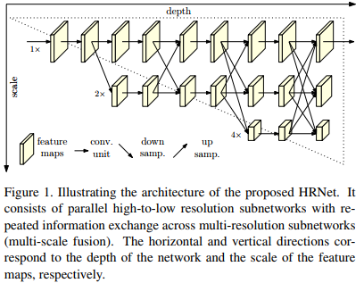
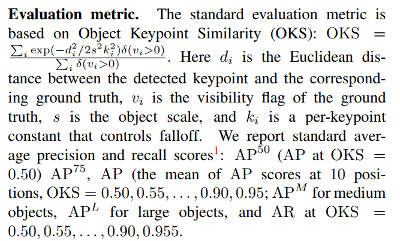

# Deep High-Resolution Representation Learning for Human Pose Estimation (2019, CVPR, MSRA)
[pdf](./HRNet.pdf)   
[paper with code](https://paperswithcode.com/paper/deep-high-resolution-representation-learning)

## Q1. 论文针对的问题？
### A1. 人体姿态估计

## Q2. 文章要验证的假设是什么？
### A2. 在整个过程中特征图（Feature Map）始终保持高分辨率。通过在高分辨率特征图主网络逐渐并行加入低分辨率特征图子网络，不同网络实现多尺度特征提取和融合。预测的heatmap在空间上更精确。
(1) 将高分辨率和低分辨率子网络并行连接，而不是像大多数现有解决方案那样串联连接。因此，特征图能够保持高分辨率，而不是通过从低到高的过程恢复分辨率，因此预测的热图可能在空间上更精确;  
(2) 大多数现有的融合方案集合了低级和高级表示。相反, HRNet执行重复的多尺度融合, 以借助于相同深度和类似level的低分辨率表示来增强高分辨率表示，反之亦然，从而导致高分辨率表示对于姿态估计也是丰富的。因此，预测的热图可能更准确。  
  

## Q3. 有哪些相关研究？如何归类？
### A3. 
(1) High-to-low and low-to-high;  
(2) Multi-scale fusion;  
(3) Intermediate supervision;  

## Q4. 文章的解决方案是什么？关键点是什么？
### A4. 
#### 4.1 Parallel multi-resolution subnetworks     
*高分辨率子网络开始作为first stage，逐步添加高分辨率到低分辨率的子网络，形成新的stage，并行连接多分辨率子网络。因此，后一阶段的并行子网络的分辨率由前一阶段的分辨率和更低的分辨率组成。*   

#### 4.2 Repeated multi-scale fusion  
*每个分辨率子网络的输入都是由所有子网络的输出聚合得到的，以下是exchange unit的形式*

#### 4.3 Heatmap estimation
(1) 最后一个exchange unit输出的高分辨率表示回归热图;
(2) 损失函数定义为均方误差;
(3) 以每个关键点位置为中心，标准差为1的2D高斯分布，生成热力图;

#### 4.4 Network instantiation
遵循resnet结构:
(1) 主体: 包含四个stage和四个Parallel multi-resolution subnetworks(分辨率每次降为一半);  
(2) 1st stage: 4个残差单元(res50那种, channels=64), 然后接kernel=3, stride=2的卷积降低分辨率;  
(3) 2nd, 3rd, 4th stages: 包含1、4和3个exchange blocks。一个exchange block包含4个残差单元，其中每个单元在每个分辨率中包含两个3×3卷积。总之，共有8个交换单元，即进行了8次多尺度融合。  
(4) 不同大小的网络：
* HRNet-W32: 后三个stage中高分辨率子网络的channel为32, 其他三个并行子网络的channel为64,128,256;  
* HRNet-W48: 后三个stage中高分辨率子网络的channel为48, 其他三个并行子网络的channel为96,192,384; 

## Q5. 评估数据集是什么？评估方法是什么？
### A5.  pose estimation
#### 5.1 COCO Keypoint Detection
* 数据集: COCO train2017上训练，val2017和test-dev2017上测试  
* 评价指标: OKS(the object keypoint similarity, 根据预测点和真实点之间的距离计算, 点坐标经过人体框大小归一化)  

#### 5.2 MPII Human Pose Estimation
* 数据集: MPII人体姿势数据集从真实世界中拍摄的图像组成，带有全身姿态标注。约有25K张图像，共40K个对象，其中有12K个对象用于测试，其余的用于训练集;
* 评价指标: PCKh(head-normalized probability of correct keypoint) score
## Q6. 文章的实验是怎么设计的？
### A6. 
#### 6.1 COCO Keypoint Detection
***COCO train2017上训练，val2017和test-dev2017上测试***
1. train step  
(1) 将人体框的高或宽扩展到固定的ratio, h:w=4:3, 然后从图像中裁剪，并调整为固定大小，256×192或384×288;  
(2) 数据增强: 缩放(±35%)、旋转(±45度)和翻转, 半身数据增强;  
(3) Adam优化器, 基础学习率1e-3, 170个epoch后下降到1e-4, 200个epoch下降至1e-5, 共210个epoch。Mini-batch为128。四个GPU。

2. test step  
(1) 使用SimpleBaselines的person detectors(faster-RCNN, AP=56.4 for the person category on COCO val2017);  
(2) 平均原始图像和flip图像的预测作为最终结果, 使用从最高响应到第二最高响应的方向上的四分之一偏移来获得关键点的最终位置;    

3. val2017和test-dev上的结果    
  

#### 6.2 MPII Human Pose Estimation  
1. train step: 同COCO, 但输入大小变为256x256(为了和其他方法对比);  
2. test step: 使用提供的人体框标注, 其余相同;  
3. 对比试验  

#### 6.3 Application to Pose Tracking(略)

#### 6.4 Ablation Study: 在COCO上
(1) Repeated multi-scale fusion:  
  

(2) Resolution maintenance: 
* 从开始就执行4个分辨率, 效果变差, 原因是低分辨率子网络的早期阶段提取的特征没有多大帮助。
* 没有低分辨率并行子网络的参数且计算复杂度相似的简单高分辨率网络, 精度下降更大。  

(3) Representation resolution:
* 使用不同分辨率feature map来预测的精度差异: 高分辨率表征是最有效的;  
  
* 不同输入大小影响: 输入图像越大越准; 与simplebaselines相比, 低分辨率下HRnet的提升更明显;  

#### 6.4 Results on the ImageNet Validation Set  
可以实现与专门为图像分类设计的网络相当的性能

## Q7. 实验方法和结果能不能支持文章提出的假设？
### A7. 

## Q8. 文章的主要贡献是什么？
### A8. 保持高分辨率的表征是有效的

## Q9. 是否存在不足或者问题？
### A9. 

## Q10. 下一步还可以继续的研究方向是什么？  
### A10. 