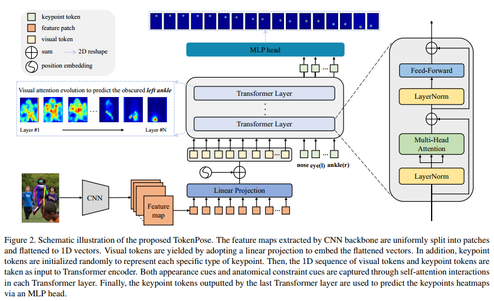

# TokenPose: Learning Keypoint Tokens for Human Pose Estimation (2021, ICCV, 清华&旷视&东南)
[pdf](./TransPose.pdf)   
[paper with code](https://paperswithcode.com/paper/transpose-towards-explainable-human-pose)

## Q1. 论文针对的问题？
### A1. *具有可解释性的人体姿态估计*

## Q2. 文章要验证的假设是什么？
### A2. 
问题: 人体姿态估计深度依赖于视觉线索和关键点之间的解剖约束来定位关键点。现有的CNN方法在视觉表示方面表现良好，但是没有抽象出具体的变量来直接表示关键点实体，这限制了模型显式捕捉part之间的约束关系的能力。  

假设: 将transformer引入姿态估计, 将关键点作为token输入进行学习, 显示的捕捉part之间的约束关系;  
 

## Q3. 有哪些相关研究？如何归类？
### A3. 
(1) Human Pose Estimation;  
(2) Vision Transformer;  
(3) Transformer;  

## Q4. 文章的解决方案是什么？关键点是什么？
### A4. TokenPose模型
#### 4.1. Architecture   
1. Backbone: ViT或者CNN, ResNet and HRNet(只保留ImageNet预训练的最初几个部分, 参数量只有原始结构的5.5%, 25%);
2. Token-based Keypoint Representation: Visual tokens由CNN的输出拉平+fc获得, Keypoint tokens是k个可学习的embedding vectors, 两者concate;
3. Transformer: 只使用encoder;  
4. Heatmap estimation: 将Keypoint tokens用fc映射到channel=HxW, 然后reshape;  
  
 

## Q5. 评估数据集是什么？评估方法是什么？
### A5.  
* 数据集: COCO, MPII    
* 评价指标: OKS(the object keypoint similarity, 根据预测点和真实点之间的距离计算, 点坐标经过人体框大小归一化), PCKh  

## Q6. 文章的实验是怎么设计的？
### A6. 
   

#### 6.1 对比实验
1. COCO  
  

1. MPII对比实验:   

#### 6.2 消融实验
1. Keypoint token fusion: concate Transformer编码器的不同层输出的Keypoint token, fc+reshape生成最终的heatmap;  
  

2. Position embedding:  
  

3. Scaling:  
  

#### 6.4 定性分析
1. Appearance cue: 可视化不同层(transformer)的visual token和keypoint token   
* keypoint token关注点逐渐从整体精确到局部位置。在前几层中密集的多人可能造成干扰, 在后几层中逐渐关注其相邻关键点和具有高置信度的关节;  
* 推断遮挡关键点时, token更关注其对称的关节。如图3所示，被遮挡的左脚踝token更关注其对称关节(右脚踝)以获得更多线索;  
  

2. Keypoint constraints cue:   
* 在前几层中，每个关键点都关注几乎所有其他关键点来构建全局上下文。随着网络的深入，每个关键点往往主要依赖于几个部分来产生最终预测;
* top-2约束往往是目标关键点的相邻和对称约束;  
 

3. Keypoint tokens learn prior knowledge from data.  
* Keypoint tokens是可学习的参数, 学习到的特征和整个训练数据集的bias有关, 与任何特定图像无关。在推断过程中，它将被用来帮助模型从具体图像中解码视觉信息并进一步做出预测。
* Keypoint tokens就像DETR中的object queries一样(每个query最终都从数据中学习了先验知识, 以专门处理特定areas和box sizes), 从数据集中学习关键点之间的统计相关性, 作为一种先验知识。  
* 为了显示Keypoint tokens中编码了什么信息, 我们计算了它们的内积矩阵。经过缩放和归一化后, 如图4所示。可以看到, 一个点往往与其对称关键点或相邻关键点高度相似。例如，左髋主要与右髋和左肩相关，相似性得分分别为0.104和0.054。这样的发现符合我们的常识，并揭示了模型所学的信息。  

## Q7. 实验方法和结果能不能支持文章提出的假设？
### A7. 

## Q8. 文章的主要贡献是什么？
### A8. 
* Token-based: Keypoint tokens
* TokenPose能够通过自我注意交互显式地捕捉外观线索和约束线索。
* 没有任何预训练的低容量纯Transformer架构也可以很好地工作。
* 与最先进的基于CNN的方法相比，混合架构以低得多的计算成本实现了具有竞争力的结果。

## Q9. 是否存在不足或者问题？
### A9. 
1. transpose在它之前(文中也提到了), 但是在对比试验中没有提到;  
2. 精度其实没有什么提升, 主要是参数量和GFLOPS降下来了;  

## Q10. 下一步还可以继续的研究方向是什么？  
### A10. 