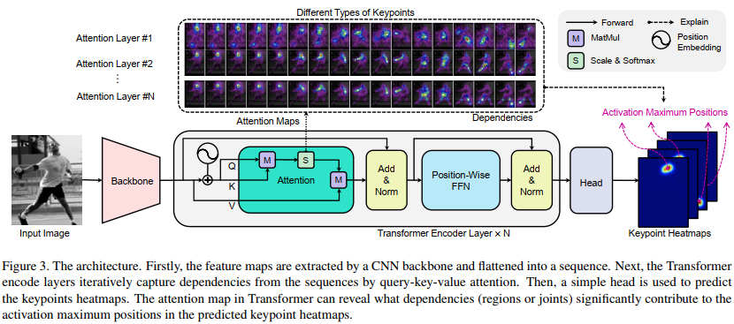

# TransPose: Keypoint Localization via Transformer (2021, ICCV, 东南大学)
[pdf](./TransPose.pdf)   
[paper with code](https://paperswithcode.com/paper/transpose-towards-explainable-human-pose)

## Q1. 论文针对的问题？
### A1. *具有可解释性的人体姿态估计*

## Q2. 文章要验证的假设是什么？
### A2. 
问题: 大多数先前的工作都将CNN作为一个强大的black box predictor, 并将重点放在改善网络结构上，模型内部到底发生了什么，或者它们如何捕捉身体部位之间的空间关系仍不清楚。  
* Deepness: 基于CNN的模型(CPM, Hourglass, Simple baselines, HRNet)通常是非常深的非线性模型，阻碍了对每一层功能的解释。  
* Implicit relationships(隐式关系): 身体部位之间的全局空间关系隐含在神经元激活和CNN权重中。 将这种关系与神经网络中的大量权重和激活分开并不容易。单独可视化具有大量通道的中间特征几乎无法提供有意义的解释。  
* Limited working memory in inferring various images: 期望的模型预测解释应该是image-specific和细粒度的。然而, 由于working memory有限, 静态卷积核表示变量的能力受限。因此，由于其内容无关的参数和可变的输入图像内容，CNN很难捕获图像特定的依赖性。  
* Lack of tools: 尽管已经有许多基于gradient或attribution的可视化技术, 但大多数技术侧重于图像分类而不是定位。它们旨在揭示特定类别的输入模式或显著性图，而不是解释变量之间的关系(例如，关键点的位置)。

假设: 将transformer引入姿态估计  
* 卷积在提取低级特征方面具有优势，但是堆积卷积以扩大感受野并不能有效地捕获全局相关性;
* transformer可以捕捉到long-range关系;
* 注意力层使模型能够捕获任意成对位置之间的交互;  

## Q3. 有哪些相关研究？如何归类？
### A3. 
(1) Human Pose Estimation;  
(2) Explainability;  
(3) Transformer;  

## Q4. 文章的解决方案是什么？关键点是什么？
### A4. TransPose模型
#### 4.1. Architecture   
1. Backbone: ResNet and HRNet(只保留ImageNet预训练的最初几个部分, 参数量只有原始结构的5.5%, 25%);
2. Transformer: 只使用encoder(将CNN的输出展平成squence作为输入);  
3. head: 将squence reshape成BxCxHxW(若H、W经历了下采样, 使用双线性插值或4×4转置卷积进行上采样), 通过1x1卷积生成heatmap;  
  

#### 4.2 Resolution Settings  
由于Transformer的计算量较大, 限制Transformer以1/r倍于原始输入的分辨率运行(ResNet-S: r=8, HRNet-S: r=4);  

#### 4.3 Attentions are the Dependencies of Localized Keypoints
(1) Self-Attention mechanism;  
(2) The activation maximum positions are the keypoints’ locations: 激活最大化(AM)的可解释性在于：可以最大化给定神经元激活值的输入区域解释了被激活的神经元在寻找什么. 在CNN模型里需要增加额外的结构, 在Transformer里已经被隐式的包含;  

## Q5. 评估数据集是什么？评估方法是什么？
### A5.  
* 数据集: COCO, MPII    
* 评价指标: OKS(the object keypoint similarity, 根据预测点和真实点之间的距离计算, 点坐标经过人体框大小归一化)  

## Q6. 文章的实验是怎么设计的？
### A6. 
#### 6.1 Technical details
(1) 输入大小: 256x192;  
(2) 数据增强: 缩放(±30%)、旋转(±40度)和翻转;  
(3) 基于ResNet-S和HRNet-S的模型命名为TransPose-R和TransPose-H，简称为TP-R和TP-H;  
(4) TP-R和TP-H的训练周期分别为230和240。使用余弦退火学习速率衰减;  
(5) 2D正弦位置嵌入作为position embedding;  
  

#### 6.2 对比实验
1. COCO  
   

2. MPII对比实验: *使用COCO训练的模型作为预训练模型, 在MPII上微调。结果表明预训练+微调的方式是十分有效的*  

#### 6.3 消融实验
1. position embedding的重要性:  

2. transformer encoder的大小:  
  
3. position embedding对于未见过的输入尺寸的影响: position embedding可以提升在不同输入下的性能;  
  

#### 6.4 定性分析
*TransPose模型的超参数配置可能以未知的方式影响其表现。选择训练的模型、预测关键点的类型、注意力层的深度和输入图像作为控制变量，以观察模型行为*
1. Dependencies and influences vary for different types of keypoints:  
* 对于头部的关键点，定位主要依靠头部的视觉信息，但TP-H-A4也将它们与肩膀和手臂的关节联系起来。 
* 两个模型预测手腕、肘部、膝盖或脚踝的依赖关系有明显差异，其中TP-R-A4依赖于同侧的局部线索，而TP-H-A4则利用了更多来自对称关节的线索(图6b、图6d、图7); 姿势估计器可能会从更多部分收集线索来预测目标关键点。这可以解释为什么模型仍然可以准确预测被遮挡关键点的位置(例如被遮挡的左脚踝)。

2. Attentions gradually focus on more fine-grained de-pendencies with the depth increasing  
观察所有的注意力层(图7的第1、2、3 行)发现，即使没有中间GT位置监督, TP-H-A4仍然可以关注关节的准确位置，但在早期注意力层中有更多的全局线索。对于这两个模型，随着深度的增加，预测逐渐依赖于局部部分或关键点位置周围更细粒度的图像线索(图7)

3. Image-specific dependencies and statistical commonalities for a single model  
与编码在CNN权重中的静态关系不同, 注意力图对输入是动态的。在图6(a)和图6(c)中, 可以观察到, 尽管预测关键点的依赖关系具有统计共性（大多数常见图像的行为相似），但细粒度的依赖关系会根据图像上下文进行预测。 由于input_B等图像中存在遮挡(图6c),模型仍然可以通过寻找更重要的图像线索来定位部分遮挡的关键点的位置，并减少对不可见关键点的依赖来预测其他关键点。 未来的工作很可能可以利用这种注意力模式进行部分到整体的关联，并为3D姿势估计或动作识别聚合相关特征;  

## Q7. 实验方法和结果能不能支持文章提出的假设？
### A7. 

## Q8. 文章的主要贡献是什么？
### A8. 
* 提出了一种基于热图的人体姿态估计方法，该方法能够有效地捕捉人体各部位之间的空间关系，基于热图预测关键点位置;  
* 证明了基于Transformer的关键点定位方法符合激活最大化的可解释性。 定性分析揭示了超出直觉的依赖关系，这些依赖关系是图像特定的和细粒度的;  
* TransPose通过更少的参数和更快的速度实现了与基于CNN的最先进模型的竞争性能。TransPose在COCO验证集和测试集上达到75.8AP和75.0AP, 参数减少73%, 比HRNet-W48快1.4 倍。 此外，模型在 MPII 基准上的迁移非常好。

## Q9. 是否存在不足或者问题？
### A9. 

## Q10. 下一步还可以继续的研究方向是什么？  
### A10. 