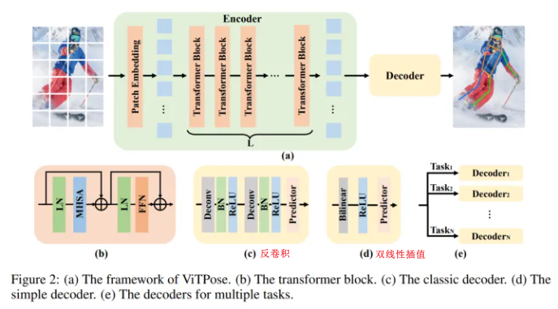
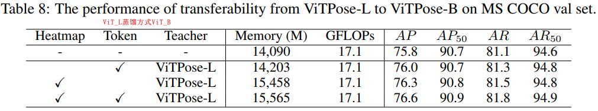

# ViTPose: Simple Vision Transformer Baselines for Human Pose Estimation (2022, NIPS, 悉尼大学计算机学院&京东)
[pdf](./ViTPose.pdf)   
[paper with code](https://paperswithcode.com/paper/vitpose-simple-vision-transformer-baselines)

## Q1. 论文针对的问题？
### A1. 人体姿态估计

## Q2. 文章要验证的假设是什么？
### A2. 最原始的ViT有很高的学习能力上限，不需要加那么多花里胡哨的设计、做那么多复杂的改进，也能学出足够高质量的特征。
*1. 这里的“复杂设计”包括了：用CNN作为Backbone提取特征、效仿CNN的层次化设计改进ViT、效仿HRNet在结构上维持高分辨率特征等等。*  
*2. ViTDet中提出的一个观点：由于减少了归纳偏置，ViT通过更大的数据量，不仅能学到具有变换等变(translation equivariant)的特征，还能学到具有尺度等变(scale equivariant)的特征。即：直接用ViT学来的最后一层特征，对它做简单的上下采样，就能作为不同尺度上的特征使用。而不必像传统CNN那样从不同的stage抽特征，也不必像FPN那样做top-down和bottom-up的尺度特征融合。*
## Q3. 有哪些相关研究？如何归类？
### A3. 
(1) Vision transformer for pose estimation: 
* TransPose：直接处理CNN提取的特征，建立全局关系;
* TokenPose: token-based representations;
* HRFormer: HRnet的transformer版本;
   
(2) Vision transformer pre-training:
* ImageNet-1K的监督训练;
* MIM: masked Image Modeling;

## Q4. 文章的解决方案是什么？关键点是什么？
### A4. 

#### 4.1 Simplicity 
(1) encoder: 最简单的ViT, 只堆叠transformer block, token的数量和channel始终不变;  
(2) decoder: 两种轻量级的解码器  
* deconv block(deconv+bn+relu)\*2 + prediction layer(1x1 conv)*1;
* 双线性插值将特征图直接上采样4倍，然后使用ReLU和内核大小为3×3的卷积层来获得输出;

#### 4.2 Scalability 
修改transformer block层数和增减特征维度，轻松控制相应的模型大小  
  

#### 4.3 Flexibility
* Pre-training data flexibility: 分别使用COCO、MS COCO和AI Challenger的组合进行预训练，方法是mask ratio=75%的MAE. 尽管姿态数据比ImageNet小得多，但ViTPose效果仍很。
* Resolution flexibility: 无论是更高的输入分辨率还是更高的特征分辨率，ViTPose的性能都会持续提高;  
* Attention type flexibility: window attention(shift window or pooling window);  
* Finetuning flexibility: 分别在所有参数未冻结、MHSA模块冻结和FFN模块冻结的情况下，在COCO上微调ViTPose。在MHSA模块冻结的情况下，ViTPose获得了与完全微调设置相当的性能;  
* Task flexibility: 由于ViTPose中的解码器相当简单和轻量级，可以采用多个解码器，通过共享主干编码器来处理多个姿态估计数据集。从每个迭代的多个训练数据集中随机抽取实例，并将其输入主干和解码器，以估计与每个数据集对应的热图。
  
#### 4.4 transferability 
* heat map 蒸馏
* token蒸馏

## Q5. 评估数据集是什么？评估方法是什么？
### A5.  
* 数据集: COCO, MPII, AI Challenger, OCHuman    
* 评价指标: OKS(the object keypoint similarity, 根据预测点和真实点之间的距离计算, 点坐标经过人体框大小归一化)  

## Q6. 文章的实验是怎么设计的？
### A6. 
#### 6.1 Implementation details
* top-down: 使用SimpleBaselines的faster-RCNN作为前置人体检测器;
* 使用ViT-B、ViT-L和ViT-H作为主干，并将相应的模型表示为ViTPose-B、ViTPose-L和ViTPose-H;
* 基于mmpose代码库，在8个A100 GPU上训练模型, 使用MAE预训练的权重初始化骨干;
* 输入分辨率256×192, AdamW优化器, 基础学习率为5e-4, 在第170和第200个epoch衰减10, 共训练210个epoch。Udp[18]用于后处理。对模型进行了210个epoch的训练，学习率在第170和第200个时期衰减了10。扫描了每个模型的分层学习速率衰减和随机下降路径比率，表1中提供了最佳设置。  
  

#### 6.2 Ablation study and analysis
1. The structure simplicity and scalability.   
(1) decoder从反卷积换成双线性插值, resnet精度下降严重, ViTPose基本不变;  
(2) ViTPose的性能随着模型大小的增加而不断提高;  
  

2. The influence of pre-training data.   
*来自下游任务本身的数据可以在预训练阶段带来更好的数据效率*  
    

3. The influence of input resolution.  

4. The influence of attention type.  
*如HRNet和HRFormer所示，高分辨率特征图有利于姿态估计任务。ViTPose可以通过改变patch embedding的下采样率(1/16->1/8)来实现高分辨率特征*  
(1) 直接使用1/8特征大小的full attention获得最高的AP77.4, 问题是即使在混合精度训练模式下，也会存在较大的内存占用;  
(2) window attention可以缓解内存问题, 但是由于缺乏全局上下文建模导致性能下降(AP 77.4->66.4）;  
(3) shift window和pooling window机制都进行了cross-window的信息交换, 全局上下文建模, AP显著提高了10, 内存增加不到10%。当将两种机制一起应用时, 性能进一步提高到76.8 AP. 这与ViTDet中提出的策略相当，该策略联合使用全注意力和窗口注意力（第6行），但内存占用量要更高;  
(4) 比较表5中的第5行和最后一行，通过将窗口大小从8×8扩大到16×12，性能可以从76.8 AP进一步提高到77.1 AP，这也优于ViTDet的方式(第6行)。  
  

5. The influence of partially finetuning.    
(1) 在MHSA冻结的情况下，与完全微调相比，性能略有下降，即75.1 AP vs 75.8 AP, 而AP50指标几乎相同;  
(2) 当冻结FFN模块并仅微调MHSA模块时，AP会显著下降3.0 。这意味着ViT的FFN模块更负责任务特定的建模。相比之下，MHSA模块更不依赖于任务，例如，无论是在MIM预训练任务还是特定姿势估计任务中，都基于特征相似性来建模token关系;  

6. The influence of multi-dataset training.  
(1) 可以通过为每个数据集使用共享主干和单独的解码器，将ViTPose扩展到多数据集联合训练。即使用COCO、AI Challenger和MPII进行多数据集训练。  
(2) 在多数据集训练后直接使用模型进行评估，而无需在COCO上进一步微调。  
(3) 观察到，ViTPose的性能从75.8 AP持续增加到77.1 AP。尽管与COCO和AI Challenger相比，MPII的容量要小得多（40K v.s 500K），但使用MPII训练仍会带来0.1 AP的增长，这表明ViTPose可以很好地利用不同数据集中的不同数据。  

7. The analysis of transferability.  
   

#### 6.3 Comparison with SOTA methods
  
  
  
  
  

## Q7. 实验方法和结果能不能支持文章提出的假设？
### A7. 

## Q8. 文章的主要贡献是什么？
### A8. 一个简单但有效的transformer基线模型  
(1) 实验了纯ViT用于人体姿态估计，在COCO数据集上取得了SOTA表现。  
(2) 验证了纯ViT所具有的诸多良好特性：结构简单、模型规模容易扩展、训练灵活、知识可迁移。  
(3) 在多个benchmark上进行了实验和分析。    

## Q9. 是否存在不足或者问题？
### A9. 

## Q10. 下一步还可以继续的研究方向是什么？  
### A10. 