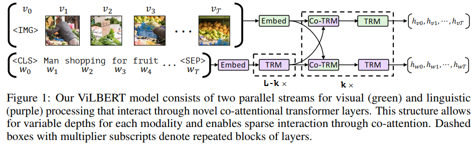
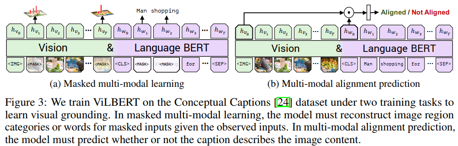

# ViLBERT: Pretraining Task-Agnostic Visiolinguistic Representations for Vision-and-Language Tasks(NIPS2019, Georgia Institute of Technology, 2Facebook AI Research, 3Oregon State University)
[paper with code](https://paperswithcode.com/paper/vilbert-pretraining-task-agnostic)

## Q1. 文章针对的问题？
### A1. 具有任务无关的视觉语言联合表征的模型(a model for learning task-agnostic joint representations of image content and natural language)

## Q2. 文章要验证的假设是什么？
### A2. 
```
We are therefore interested in developing a common model for visual grounding that can learn these connections and leverage them on a wide array of vision-and-language tasks – i.e., we seek to pretrain for visual grounding.
```

## Q3. 有哪些相关研究？如何归类？
### A3. BERT  

## Q4. 文章的解决方案是什么？
### A4.
```
Our approach extends the recently developed BERT language model to jointly reason about text and images. 
Our key technical innovation is introducing separate streams for vision and language processing that communicate through co-attentional transformer layers. 
This structure can accommodate the differing processing needs of each modality and provides interaction between modalities at varying representation depths
```

### 4.1 drawbacks of using BERT straightly
通过聚类简单地离散视觉输入得到visual tokens, 并像text tokens一样输入预训练的BERT模型以进行训练;
1. 初始聚类的方式可能会导致离散误差、丢失重要的视觉细节;
2. 对来自两种模态的输入一视同仁, 忽略了由于其固有的复杂性或其输入表示的初始抽象级别, 例如图像区域之间相较于句子中的单词之间, relation更弱, 另外视觉特征本身往往已经是深层网络的输出。因此visual和text需要不同级别的处理;
3. 强迫BERT适应额外的visual token可能会损害预先训练得到的部分信息;

### 4.2 ViLBERT: consists of two parallel BERT-style models operating over image regions and text segments.
  

1. Co-Attentional Transformer Layers:  
     
2. Image Representations:   
   (1) 通过预训练的目标检测网络中提取边界框及其视觉特征来生成图像区域特征.   
   (2) 与文本中的单词不同, 图像区域缺乏自然地顺序。我们对空间位置进行编码, 根据区域位置（归一化的左上角和右下角坐标）和对应图像区域的分数构建一个5维向量。然后将其投影为与视觉特征的尺寸相匹配，并对其进行求和.  
   (3) 用一个特殊Token[IMG]来标记图像区域序列的开始, 该Token同时也对应于整个图像的空间编码的平均合并视觉特征;
 
3. Training Tasks and Objectives:  
   (1) masked multi-modal modelling: word和image region合计随机mask 15%, 利用剩下的token进行重建. masked image regions时有90%的可能置零, 10%的可能不变. 重建目标不是回归mask部分的feature, 而是根据语义预测masked image regions的分布(用KL散度衡量预测分布和真实分布), 这是由于语言常常能反应图片的高级语义, 但无法描述精确的信息。masked text inputs时处理方式和BERT一致.  
   (2) multi-modal alignment prediction: 预测图像和文本是否对齐, 即文本是否描述图像. 具体的做法是hIMG和hCLS作逐元素相乘, 并学习一个线性层判断图像和文本是否对齐.    
     


## Q5. 实现细节
### A5.1 Training ViLBERT
1. datasets: Conceptual Captions, 由330w的图像文本对组成, 网络图像自动抓取;  
2. text encoder使用预训练的BERT-Base模型;  
3. 使用Visual Genome上预训练的Faster R-CNN(ResNet-101)来提取区域特征, 选择类别检测概率超过置信阈值的box, 数量保持在10~36. 对于每个region, vi被定义为来自使用该region的平均池化特征做为visual token. visual stream中的Transformer隐藏层维度为1024和head数量为8;  
4. 8 TitanX GPUs, batch_size=512, epochs=10, Adam optimizer with initial learning rates of 1e-4.
     
### A5.2 Vision-and-Language Transfer Tasks
1. Visual Question Answering (VQA)  
2. Visual Commonsense Reasoning (VCR)  
3. Grounding Referring Expressions  
4. Caption-Based Image Retrieval  
5. ‘Zero-shot’ Caption-Based Image Retrieval

## Q6. 文章的实验是怎么设计的？
### A6.
#### 6.1 comparison
  

#### 6.2 ablation
 

 


## 参考文献
[1] Frozen clip models are efficient video learners.  
[2] Parameter-efficient transfer learning for nlp.  