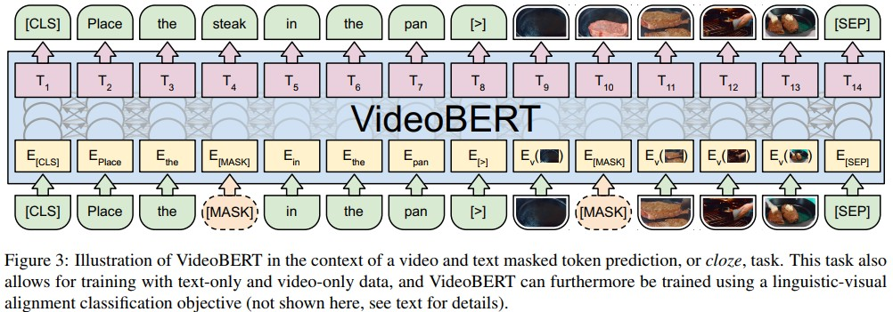

# VideoBERT: A Joint Model for Video and Language Representation Learning (google)
[paper with code](https://paperswithcode.com/paper/videobert-a-joint-model-for-video-and)  

 

## Q1. 文章探究的问题？
### A1. 一种联合视觉语言模型来学习高级特征的自监督训练方法


## Q2. 文章主要思路？
### 2.1 视频模态处理
* 数据: 以fps=20采样视频帧, 单个clip包含30帧(1.5秒, 不重叠)
* 使用S3D(Kinetics预训练)处理单个clip: 取最终的线性分类器之前的特征，应用3D平均池来获得1024维的特征向量;
* 使用层次k-means聚类做tokenize: 层次k-means中levels=4, k=12, 因此产生了12^4=20736个簇;
* video token embedding = 相应聚类中心的S3D特征;

  

### 2.2 语言模态处理
1. 对于每个ASR单词序列，使用现成的基于LSTM的语言模型添加标点符号，将单词流分解为句子。
2. 对于每个句子，遵循BERT中的标准文本预处理步骤, 将文本标记为WordPieces。词表与BERT一致, 包含30000个tokens。

```
ASR转录出的语义内容和视频的视觉内容可能是不一致的, 为了解决这一问题: 
1. 首先将相邻的句子随机连接成一个长句子，以允许模型学习语义对应，即使两者在时间上没有很好地对齐。
2. 其次，由于即使是同一动作的状态转换速度在不同视频之间也可能有很大差异，因此我们为视频令牌随机选择1到5步的子采样率。这不仅有助于模型对视频速度的变化更具鲁棒性，还允许模型在更大的时间范围内捕捉时间动态，并学习更长期的状态转换
```

```
与可以自然分解成句子的语言不同，目前尚不清楚如何将视频分解成语义连贯的片段。我们使用一个简单的启发式方法来解决这个问题：当ASR句子可用时，它与开始和结束时间戳相关联，我们将落入该时间段的视频token视为一个片段。当ASR不可用时，我们简单地将16个令牌视为一个分段。
```

### 2.3 结构
* BERT: 从预训练的BERT-large初始化权重;
* 训练: 在Pod配置中使用4个Cloud TPU, total batchsize=128, 50万次迭代，大约8个epoch。我们使用初始学习率为1e-5的Adam优化器和线性衰减学习率。训练过程大约需要2天。
* target: 对于纯文本和纯视频, target为标准的mask-completion; 对于视频文本输入, 使用target为linguistic-visual alignment classification。文本目标迫使VideoBERT做好语言建模；视频目标迫使其学习“视频语言模型”，可用于学习动态和预测；而文本视频目标迫使其学习两个领域之间的对应关系。


### 2.3 数据
* 使用YouTube视频注释系统从YouTube上检索与“烹饪”和“食谱”相关的视频, 删除超过15分钟的视频, 生成312K个视频。总持续时间为23186小时, 约966天。比第二大烹饪视频数据集YouCook II大两个数量级以上, (2K个视频, 总时长176小时)
* 为了从视频中获取文本，利用YouTube Data API提供的YouTube自动语音识别(ASR)工具包来检索带时间戳的语音信息。API返回单词序列和预测的语言类型。在312K个视频中, 有180K个ASR可以通过API检索，其中120K个视频是英文的
* 将所有视频用于纯视频目标，但仅将英语ASR中的文本用于纯文本目标和视觉文本目标


## Q3. 实现和结果
## 3.1 Zero-shot action classification
  

## 3.2 Video captioning
  


