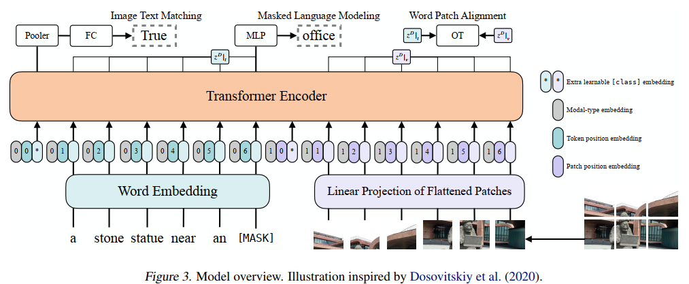
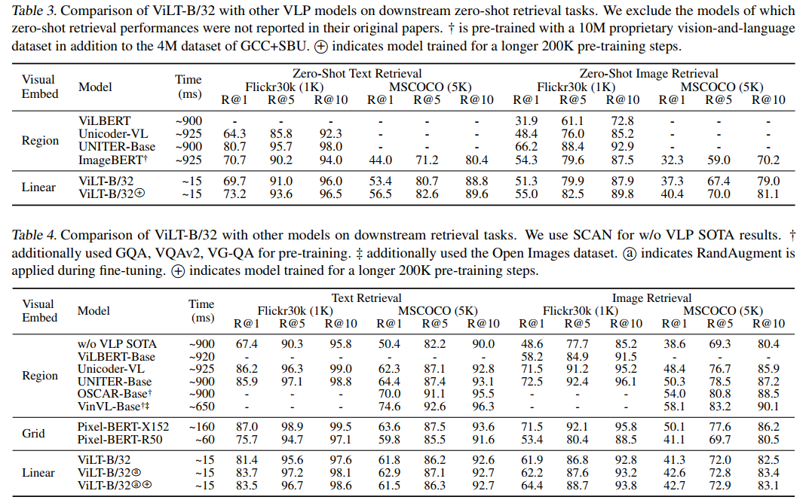

# ViLT: Vision-and-Language Transformer Without Convolution or Region Supervision(ICML 2021)
[paper with code](https://paperswithcode.com/paper/vilt-vision-and-language-transformer-without)

## Q1. 文章针对的问题？
### A1. 
之前的VLP(vision-and-language pre-training)依赖于目标检测和CNN架构, 因此：
1. 在速度和效率上, 单个模态的特征提取会占用比多模态交互更多的计算和耗时;
2. 在表达能力上, 用一个预训练好的模型去抽取特征, 表达能力受限;

## Q2. 文章要验证的假设是什么？
### A2. singlestream approach, 不使用额外的目标检测网络进行region embedding, 而是直接使用patch embedding. 更多地关注多模态之间的交互;

## Q3. 有哪些相关研究？如何归类？
### A3.   

## Q4. 文章的解决方案是什么？
### A4.1 pipeline
  

1. 图像部分的embedding通过patch操作得到, 文本通过linear embedding得到word token;  
2. 两个模态分别加上各自的position-embedding、modal-type embedding, 拼接成squence(可以添加额外的token);  
3. 经过多层transformer encoder后得到最后的编码序列;
4. 文章使用预训练的ViT模型初始化, 而不是BERT;

### 4.2 Pre-training Objectives
1. image text matching: image text alignment, word patch alignment;  
2. masked language modeling; 

### 4.3 数据增强方法
1. Whole Word Masking: 对整个单词mask, 而不是分词(wordpiece);
2. Image Augmentation: 在finetune过程中使用随机的图像数据增强, 除了颜色变换(因为文本中通常包含颜色描述)和剪切操作(裁剪有可能去掉一些物体);

## Q5. 实验设计
在COCO、Visual Genome、SBU Captions、Google Conceptual Captions上预训练, 下游任务classification(数据集VQAv2)和retrieval(数据集NLVR2)
   
### A5.1 comparison
1. 下游任务精度  
     

2. 推理速度  
   

3. 模型复杂度  
   
     
### A5.2  Ablation
1. augments  
    

