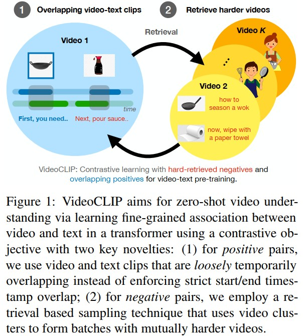

# VideoCLIP: Contrastive Pre-training for Zero-shot Video-Text Understanding (Facebook AI)
[paper with code](https://paperswithcode.com/paper/videoclip-contrastive-pre-training-for-zero)  

 

## Q1. 关键词
### A1. 视频文本对比学习, 用于预训练zero-shot视频文本理解的统一模型

## Q2. 文章主要思路？
### 2.1 VideoCLIP Pre-training
1. 将video clip送入冻住的预训练的CNN视频编码器和一个可学习的MLP, 得到video tokens, dims和word embeddings相同;
2. text tokens通过embedding得到(BERT方式)
3. video tokens和text tokens分别送入两个可学习的Transformers;
4. 应用平均池化得到video feature和text feature;
5. 应用contrastive losses;  
   

### 2.2 Overlapped Video-Text Clips
1. 对text clip进行采样, 因为先采样video clip可能导致附近没有对应的文本;
2. 在text clip的时间范围内采样一个时间戳作为video clip的中心;
3. 从该中心时间戳开始，以随机时长（最多32秒）采样video clip;

***使用这种采样方式的原因在于当时的数据中, text是通过语音转录出来的而不是人工对视频画面进行描述, 因此会存在一个问题, 即同一个时间片段内语音的语义内容和视频的语义内容是对不上的, 那么在构建正负样本对时会存在比较严重的噪声***

### 2.3 Retrieval Augmented Training: Dense Video Cluster Retrieval
***通过在对比预训练目标中使用难例来学习更细粒度的视频文本相似性建模***
对每个epoch执行:  
1. 对每个视频的所有video-text clip的embedding进行平均来计算全局特征;  
2. 对所有视频建立密集索引(dense index), 作者使用的方法是FAISS(Facebook AI Similarity Search, Facebook AI团队开源的针对聚类和相似性搜索库，为稠密向量提供高效相似度搜索和聚类, 支持十亿级别向量的搜索，是目前较成熟的近似近邻搜索库);
3. 随机选取C个视频(C=训练集的总batch数). 对每个视频, 在其2k近邻中随机采样出k个近邻作为一个聚类, 相比于直接使用k近邻, 这样做的好处是类内的每个video之间都是彼此相近的, 而不是仅仅和类中心相似。在训练时, 一个video中的所有video-text clips可以作为类内其他视频的video-text clip的负样本。

### 2.4 Zero-shot Transfer to End Tasks
* Text-->Video Retrieval
* Multiple-choice VideoQA
* Action Segmentation: 为视频的每个token(或帧)分配一个预定义标签，以将视频的有意义片段与其余token(或框)分离, 类似于NLP中的序列标记任务(如NER). 受CLIP设置的启发, VideoCLIP的文本编码器可以在预训练期间作为视频的自监督，也可以作为超网络为视频token提供segment文本标签的隐状态。因此，每个视频令牌的隐状态可以具有segment标签上的相似分布。此任务测试视频token与文本的相似度
* Action Step Localization: 

## Q3. 实现和结果
### 3.1 VideoCLIP Pre-training
* 数据: 基于HowTo100M, 在过滤掉不可用或无法解码的视频后使用110万个视频. 随机抽取4K视频作为验证集，其余用于预训练。每个视频平均持续时间为6.5分钟, 包含视频文本对为110个。在从ASR中删除重复的单词后，我们最终得到了7.7GB的文本转录，平均每秒2.4个tokens

* video encoder: S3D, 在HowTo100M上进行预训练, dims=512。我们使用30fps，每秒提取一个video token;
* Transformers: 用预训练的BERT_base-uncased初始化video and text Transformers, 只将前6个Transformer层用于视频输入，将所有12个层用于文本输入。使用具有GELU激活的单层MLP将S3D输出映射到768维。

* 将video token的最大数量限制为32。video transformer的输入长度为34，带有[CLS]和[SEP]标记。text transformer输入长度为63(61个text token加上[CLS]和[SEP]标记)。text token的数量大约是video token数量的两倍, 因为在HowTo100M数据中，文本以每秒约2.4个token的速度出现，而我们的video token以每秒1个的速度提取。text clip的随机长度在8到61个token之间，而video clip的长度为3到32秒。我们从每个视频中采样16个视频/文本对，并使用k=32个视频来形成大小为batchsize=512的批次.

* 8个V100 GPU, 使用fp16精度进行25个epoch的预训练，持续约1天。使用Adam作为优化器，betas=(0.9，0.98)，初始学习率为5e-5，预热1000步，多项式衰减学习率。梯度被剪裁为2.0。softmax温度设置为1.0;

### 3.2 Main Results
<table border="1" width="1200px" cellspacing="10">
<tr>
  <td colspan="3" align="center">Text-video Retrieval</td>
</tr>
<tr>
  <td align="center"></td>
  <td align="center"></td>
  <td align="center"></td>
</tr>
<tr>
  <td align="center">Video Question Answering</td>
  <td align="center">Action Segmentation</td>
  <td align="center">Action step localization</td>
</tr>
<tr>
  <td align="center"></td>
  <td align="center"></td>
  <td align="center"></td>
</tr>
</table>

### 3.3 Ablation Study
