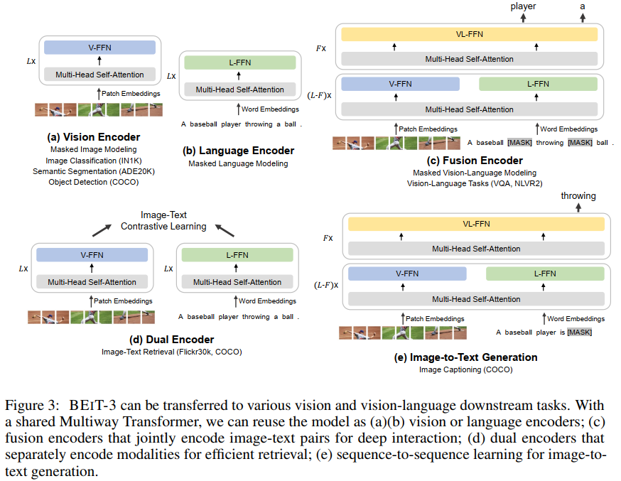

# Image as a Foreign Language: BEiT Pretraining for All Vision and Vision-Language Tasks(2022, Microsoft)
[paper with code](https://paperswithcode.com/paper/image-as-a-foreign-language-beit-pretraining)

## Q1. 文章针对的问题？
### A1. a general-purpose multimodal foundation model

## Q2. 文章要验证的假设是什么？
### A2. 
```
对于vision-language建模，由于下游任务的性质不同，应用Transformer的方法多种多样。例如，dual-encoder用于retrieval, encoder-decoder用于生成任务, fusion-encoder用于图像-文本编码。然而, 大多数foundation models必须根据特定的体系结构手动转换最终任务格式。这些参数通常不能有效地在各种模式之间共享。
在这项工作中，我们采用Multiway Transformers进行通用建模，即为各种下游任务共享一个统一的架构。模块化网络还综合考虑了模态特定编码和跨模态融合。
```

## Q3. 有哪些相关研究？如何归类？
### A3.   

## Q4. 文章的解决方案是什么？
### A4.1 Backbone Network: Multiway Transformers
1. 每个Multiway Transformer Block由一个共享的self-Attention和一组不同的FFN组成;
2. 不同模态的token经过共享的self-Attention, 然后被路由到各自的FFN;
3. 在前3个blocks中还有一个融合FFN;   
     

### 4.2 Pretraining Task: Masked Data Modeling
1. 统一使用Masked Data Modeling对单模态和多模态进行BEiT-3预训练;
2. 预训练过程中, text token来自SentencePiece tokenizer, image token通过the tokenizer of BEiT-v2产生;
3. 单文本模态mask15%的text token, 图像文本对mask50%的text token, 单图像模态mask40%的image patches;
4. 只使用一个预训练任务, 使得训练过程可以友好地扩展。相比之下，以前的视觉语言模型通常使用多个预训练任务，如图像文本对比、图像文本匹配和单词补丁/区域对齐。我们表明，更小的batchsize可以用于mask-then-predict任务。相比之下，基于对比学习的模型通常需要非常大的batchsize来进行预训练(***CoCa batchsize=65k, CLIP batchsize=32k, Florence batchsize=24k, BEIT-3 batchsize=6k***)

### 4.3 Scaling Up: BEIT-3 Pretraining
1. Backbone Network: 
   ```
   Notice that only vision-related parameters (i.e., comparable size as ViT-giant; about 1B) are activated when the model is used as a vision encoder.
   ```  
     

2. Pretraining Data  
     

3. Pretraining Settings  
   * total_steps=1M
   * batchsize=6144, include 2048 images, 2048 texts and 2048 image-text pairs
   * patch_size=14x14, image_size=224x224
   * random resized cropping, horizontal flipping, and color jittering
   * AdamW optimizer with β1=0.9, β2=0.98 and e=1e-6 
   * cosine learning rate decay scheduler with a peak learning rate of 1e-3 and a linear warmup of 10k steps
   * weight decay=0.05
   * Stochastic depth=0.1
   * BEiT initialization algorithm

## Q5. 实验设计
在COCO、Visual Genome、SBU Captions、Google Conceptual Captions上预训练, 下游任务classification(数据集VQAv2)和retrieval(数据集NLVR2)
   
### A5.1 Vision-Language Downstream Tasks
1. VQA, Visual Reasoning: BEIT-3 as a fusion encoder  
2. Visual Reasoning: BEIT-3 as a fusion encoder  
3. Image Captioning: BEIT-3 is used as a conditional generation
model via masked finetuning
```
1. image token只能在image squence中做attention;
2. caption token只能和image token, 该token之前的caption token做attention;
3. finetune过程中随机mask一定的caption token并进行重建;还会mask token [SEP]来让模型学习终止生成过程;
4. 在推理过程中使用autoregressive的方式生成caption tokens
```
    

5. Image-Text Retrieval: BEIT-3 as a dual encoder  
   
     
### A5.2  Vision Downstream Tasks
1. Object Detection and Instance Segmentation
2. Semantic Segmentation
3. Image Classification  
     
     
     


## Q6. 个人理解
### A6. 
文章的主要思路是Multiway Transformer + Masked Data Modeling, 其中Multiway Transformer的结构来自VLMo, 两者的区别是:
1. VLMo在预训练时额外使用了image-text contrast和image-text matching任务;
2. VLMo是分阶段训练的, 先在单独的图像数据上训练自注意力层和visual-FFN expert; 然后在单独的文本数据上训练text-FFN expert(冻结了自注意力层); 最后在多模态数据上训练自注意力层和三种FFN experts.

