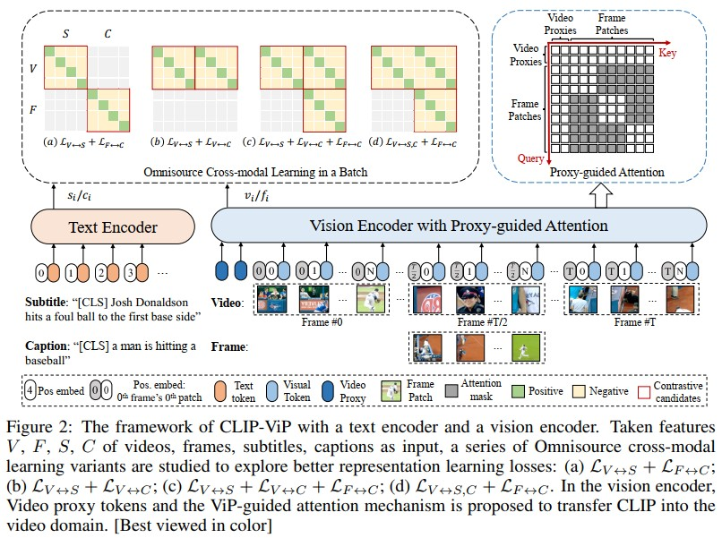

# CLIP-ViP: Adapting Pre-trained Image-Text Model to Video-Language Representation Alignment (Microsoft)
[paper with code](https://paperswithcode.com/paper/clip-vip-adapting-pre-trained-image-text)  

 

## Q1. 文章探究的问题？
### A1.1 Abstract
* 视频文本检索任务
* 将image-text pre-trained models adapt到video-text pre-training(即post-pretraining)没有得到预料中的显著效果, 因此文章主要解决下面两个问题:
  1. 阻碍后post-pretraining CLIP提高视频文本任务性能的因素是什么?
  2. 如何减轻这些因素的影响


## Q2. 文章主要思路？
### 2.1 问题分析
#### 2.1.1 视频-文本数据集规模的影响
* 模型: CLIP-ViT-B/32 + MeanPool处理多帧(CLIP4Clip的做法)
* 数据集:
  * 小: WebVid-2.5M
  * 中: HD-VILA-10M(从HD-VILA-100M中随机抽出来的)
  * 大: HD-VILA-100M
* 训练: 
  * 在三种数据规模上训练相同的step(相当于HD-VILA-100M的一个epoch), 每个视频均匀采样12帧
  * 在MSR-VTT(文本到视频检索任务)上微调来评估预训练模型
* 结论: 在小数据集上精度下降显著, 过拟合

   


#### 2.1.2 语言域和下游数据的差距
```
显然, 预训练数据与下游数据的域越相近, 下游任务效果越好。但是, 大多数视频文本任务(视频文本检索), 文本是视频的描述, 而HD-VILA-100M的文本是自动转录的, 同时还存在不相关、错位和ASR错误的问题。  
```
为了探索预训练和下游数据的语言域差异: 
  * 用CLIP的text encoder提取所有文本特征, 然后使用K-means得到两个聚类;
  * 计算聚类标签和ground truth之间的归一化互信息(NMI)。NMI值越大, 说明两种类型的特征越容易区分, 即存在更大的gap。
结果发现: 发现HD-VILA和下游数据之间的NMI得分远大于其他数据, 尤其是MSR-VTT  
   


### 2.2 解决方案: CLIP-ViP
#### 2.2.1 域内辅助数据生成(in-domain auxiliary data generation)
既然知道了预训练数据与下游数据存在语言域gap, 那么就要想办法减小gap. 作者采用的方法是给预训练数据添加辅助的caption, 那么辅助的caption怎么生成呢?  
作者使用了一个image caption模型(OFA Caption)为HD-VILA-100M中的每个视频的中间帧生成一个caption, 原因如下:  
1. 大多数Video Caption的SOTA模型都是用视频文本数据集(如MSR-VTT、ActivityNet)训练的。但是这些数据集会用于下游任务, 所以要避免数据泄露;
2. 现有Video Caption模型的性能远远落后于image caption

#### 2.2.2 Video Proxy Mechanism
由于视频-文本数据集比较小(相对于CLIP的训练数据), 为了避免post-pretrain的过拟合, 就要尽可能得不改变CLIP-ViT的结构。  
(1) 位置编码由空间位置编码+时间位置编码组成:  
 

(2) Video Proxy: CLIP是在图像上预训练的, 那在训练中很难做帧间的token交互, 作者引入了Video Proxy tokens作为代理, 帮助每个local patch感知视频级别的时间信息。
  * Video Proxy tokens和patchs拼接在一起, 通过attn-mask控制Video Proxy tokens可以看到所有token, 而patch tokens只看到同一帧中的token和Video Proxy tokens, 称为proxy-guided attention
  * proxy-guided attention既让patch tokens看到了全局信息, 又最大程度的减少了与原始CLIP计算的不一致

图像输入视为特殊的单帧视频, 使用线性插值来获得中间时间位置编码, 从而能够在同一批视频和图像上进行联合训练;

### 2.3 omnisource cross-modal learning
作者使用对比学习的方式从video-subtitle pairs中学习丰富的视频语言对齐。  
由于生成了域内辅助数据, 现在数据集包括: 
* 视频输入(V, video)及其文本描述(S, subtitle)
* 视频的中间帧(F, frame)及其生成的文本描述(C, caption)  

那么对比学习损失就存在以下组合:
* L(V, S)
* L(V, S) + L(F, C)
* L(V, S) + L(V, C)
* L(V, S) + L(F, C) + L(V, C)
* L(V, S, C) + L(F, C)  

其中L(V, S, C)为:  
   


## Q3. 实现和结果
### 3.1 实现细节
1. Video-Text Post-Pretraining
   * video: input size=224x224, frame_num=12, average_clip_time=13.4, 均匀采样
   * text: 采用CLIP的tokenizer将句子拆分为最大长度为70的word tokens
   * AdamW优化器， 初始学习率为5e-6, weight decay=5e-2, 余弦衰减和预热。
   * 32卡V100, batchsize=1024
   * 在HD-VILA-100M上, 消融实验训练一个epoch, 完整训练三个epoch

2. Fine-tuning Training
   * batchsize=128
   * 初始学习率1e-6, weight decay=0.2
   * epochs：下游数据集的规模不同, 将MSRVTT、DiDeMo、LSMDC和ActivityNet的epochs分别设置为5, 20, 10和20
   * 帧数：为了公平比较, 帧数设置为12，除了ActivityNet(设置为32, 因为它的视频要长得多(平均180秒))

3. Downstream Datasets
   * MSR-VTT
   * DiDeMo
   * LSMDC
   * ActivityNet Captions
  
### 3.2 消融实验
1. Video Proxy Mechanism(对应2.2.2 Video Proxy Mechanism)    
 

2. Omnisource Cross-modal Learning(对应2.3中提出的loss组合)    
 

3. Auxiliary Data(对应2.2.1 域内辅助数据生成)  
 

### 3.3 Comparison to SOTA models
  
