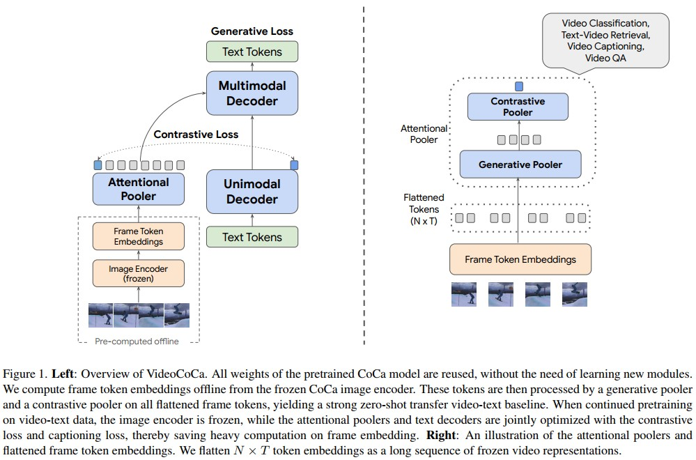
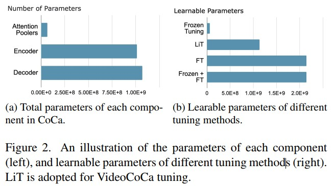

# VideoCoCa: Video-Text Modeling with Zero-Shot Transfer from Contrastive Captioners (google)
[paper with code](https://paperswithcode.com/paper/video-text-modeling-with-zero-shot-transfer)  

 

## Q1. 关键词
### A1. 视频-文本基础模型
* foundational video-text model
* contrastive captioner (CoCa)


## Q2. 文章主要思路？
### 2.1 Transferring CoCa to Video-Text Tasks
复用image CoCa的结构, 以最低的成本快速转换到视频领域, 尝试了四种不同的adapt方案:
* Attentional poolers: 分别处理每帧图像
  ```
  1. 将shape=(B*T, N, C)的ViT(img encoder)输出reshape成(B, T*N, C), 
  2. 输入到image CoCa中的Generative Pooler和Contrastive Pooler;  
  ```

* Factorized encoder: 分别处理每帧图像
  ```
  1. 将ViT的输出输入到Generative Pooler和Contrastive Pooler, 得到spatial embeddings(shape=(B*T, C))并reshape成(B, T, C);
  2. 通过4层transformer encoder学习帧间信息, 输出的tokens用于计算caption loss;
  3. 对2中输出的tokens作全局平均池化, 用于计算contrast loss
  ```

* Joint space-time encoder: 将patch embedding之后的每帧token拼接成一个序列(shape=(B, T*N, C)), 然后送入img encoder. 之后的处理和image CoCa一致.

* Mean pooling: Attentional poolers之后在时间维度上简单地做平均池化. 用来做adaptor baseline.
  

### 2.2 Finetuning VideoCoCa on Video-Text Data
  除了从image-text CoCa到video-text任务的zero-shot transfer, 自然会考虑通过对video-text数据进行pretrain来进一步提高VideoCoCa的极限。  
  作者使用VideoCC3M作为训练数据的主要来源, 并探索了四种不同的训练方式, 并通过分析得出了最佳设置(即LiT)。


#### 2.2.1 四种不同的训练方式
* Finetuning(FT): 放开CoCa模型所有的参数. 可能会导致训练不太稳定。作者将其用作baseline tuning method.
* Frozen encoder-decoder tuning (Frozen): 冻住encoder和decoder的参数, 只调整Generative Pooler和Contrastive Pooler的参数. 基本复用了CoCa的全部参数
* Frozen tuning then finetuning (Frozen + FT): 两步微调, 先用Frozen的方式再用FT的方式;
* Frozen encoder tuning (LiT): 冻住img encoder, 训练Generative Pooler、Contrastive Pooler和decoder的参数;

   

#### 2.2.2 预训练数据
***在实验中, 只在数据集上训练模型一个epoch, 以减轻灾难性遗忘.***  
* HowTo100M: 136M的clip, 来自于1.2M的video, 文本是通过ATS(automatically transcribed speech)得到的;
* VideoCC3M: 从image captioning数据集CC3M中挖掘出来的。包括约8.7M个video clip-text和900K独特的captions。与仅限于教学视频的HowTo100M[33]不同，VideoCC3M是从更多样的在线视频语料库中创建的，因此更平衡。
  
  
## Q3. 实现和结果
### 3.1 实现
1. Zero-shot video classification
   * datasets: Kinetics, UCF101, HMDB51, Charades;
   * 根据之前文章的方式，使用对齐的视频/文本嵌入来执行零样本视频分类，方法是将视频与标签名称进行匹配，而不进行微调。

2. Zero-shot text-video retrieval
   * datasets: MSR-VTT, ActivityNet-Captions, Youcook2;
   * 指标: Recall at K (R@K)

3. Video captioning
   * datasets: MSR-VTT, ActivityNet-Captions, Youcook2, VATEX;
   * 指标: BLEU-4, CIDEr, and ROUGE

4. Finetuning for video question answering
   * datasets: IVQA, MSRVTT-QA, MSVD-QA and ActivityNet-QA


### 3.2 结果
#### 3.2.1 Ablation study 
| Adaptor choices | Tuning choices | mixing ratios |
| :--------: | :--------: | :--------: |
|  |  |  |

| Model scaling |
| :--------: |
|  |

#### 3.2.2 Main Results
| Zero-shot video classification |
| :--------: |
|  |
| Zero-shot text-video retrieval |
|  |
| video captioning |
|  |
| video question answering |
|  |