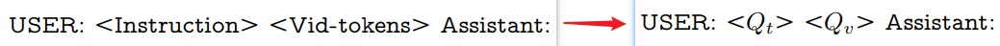

# Video-ChatGPT: Towards Detailed Video Understanding via Large Vision and Language Models
[paper with code](https://paperswithcode.com/paper/video-chatgpt-towards-detailed-video)  

 

## Q1. 关键词
### A1. 基于视频的语言对话模型
* Video Understanding
* LLM
* instruction-tuning
* video-adapted visual encoder


## Q2. 文章主要思路？
### 2.1 model
#### 2.1.1 Architecture
* foundation: LLaVA, visual encoder=CLIP ViT, text decoder=Vicuna
* video-adapted: 
  ```
  1. 将T帧frame当作图像处理, encoder为LLaVA训练的CLIP ViT-L/14, 得到frame-level embeddings(shape=(B, T, N, C))
  2. 分别在时间维度和空间维度上进行average-pooling, 得到video-level temporal representation(shape=(B, N, C))和video-level spatial representation(shape=(B, T, C))
  3. concatenate得到video-level features: Vi=[ti zi]
  4. 通过一个简单的线性层将Vi投影到language decoder’s embedding space, 将video-level features转换为相应的language embedding tokens: Qv
  ```
* text decoder: 将video-adapted得到的Qv和text的查询Qt拼接输入到LLM中

#### 2.1.2 Video Instruction Tuning
* 自回归训练
* prompts: \<Instruction\>表示与视频有关的问题，该问题是从训练集中随机采样的。问题可以是一般性的，要求描述视频，也可以与视频内容的特定时间、空间或创造性方面有关  
   
* 整个训练过程中，视频编码器和LLM的权重都保持冻结，该模型通过调整线性层来最大化the likelihood of predicting tokens representing the answer

### 2.2 Video Instruction Data Generation: 人工标注+半自动标注方法

#### 2.2.1 人工标注
基于包含video-caption pairs的数据集, 利用标注人员的专业知识来丰富原始的caption。
* 数据集: ActivityNet-200的一个子集，该数据集提供了不同视频片段中各种活动的简明实况描述。
* 标注人员通过添加关于物理外观、空间和时间定位以及其他关键上下文细节的综合信息, 进一步丰富了captions。  

[通过人工辅助注释丰富数据的示例](./Examples%20of%20data%20enrichment%20via%20human-assisted%20annotation.jpg)

#### 2.2.2 半自动标注
* 利用现有的模型生成标注:
  ```
  1. BLIP-2 image-captioning模型生成帧级caption
  2. GRiT dense captioning模型生成scene objects的详细描述
  3. Tag2Text于为视频的每个关键帧生成tag
  ```
* 由于上述模型的结果可能存在错误, 采取以下步骤:
  ```
  1. 所有现成模型保持较高的预测阈值，以保持准确性;

  2. 过滤: 从BLIP-2或GRiT中删除任何与Tag2Text帧级tag不匹配的帧级caption。该过程包括从预定义的Tag2Text标签词汇表中的帧级caption中提取单词，并消除任何包含不在给定帧的tag中的单词的caption。该策略充当了一个额外的过滤层, 通过整合来自多个模型的预测来丰富caption。
  
  3. 合并帧级caption, 并使用GPT-3.5生成连贯的视频级caption。我们还指示GPT-3.5丢弃跨帧的不一致信息, 以确保精确、上下文丰富的视频指令数据集
  ```
[通过半自动标注丰富数据的示例](./Examples%20of%20data%20enrichment%20using%20our%20proposed%20semi-automatic%20annotation.jpg)


#### 2.2.3 GPT-Assisted Postprocessing
提示GPT-3.5模型从范围广泛的丰富而详细的captions中创建问答对。
这些范围包括详细的描述、总结、问答配对、激发创造力或产生新想法的任务、对话任务。

## Q3. 实现和结果
### 3.1 实现
1. 模型训练
   * baseline: LLaVA
   * data: 100K video instruction pairs
   * 只更新线性层, 将视频特征投影到LLM的输入空间, 而架构的其余部分保持冻结
   * lr=2e−5, batchsize=32, epoch=3, 7B模型的训练在8个A100 40GB GPU上花费了大约3个小时。
   * 在推理过程中，为了提高内存效率，我们以FP16模式加载模型;

2. 半自动标注
   * 使用Katna提取视频关键帧;
   * Tag2Text使用Swin-B版本, 输入大小为384×384，置信阈值为0.7;
   * GRIT使用带有CenterNet2的ViT-B版本;

### 3.2 结果
#### 3.2.1 定量评估
1. Video-based Text Generation Performance Benchmarking
   * 基于ActivityNet-200构建具有丰富、密集的描述和来自人工注释的相关问答对的测试集;
   * 使用GPT-3.5模型开发了一个evaluation pipeline, 评估模型的各种能力，并在以下五个方面为生成的预测分配1-5分的相对分数：
        ```
        (1) 信息的正确性：验证生成文本的准确性, 确保其与视频内容一致, 不会误解或误传;
        (2) 细节导向：模型响应既要涵盖视频中的所有要点, 还要包含特定细节，而不仅仅是一般点;
        (3) 上下文理解：评估模型对视频上下文的理解，检查其响应是否与视频内容的整体上下文一致;
        (4) 时间理解：检查模型对视频中事件时间序列的把握;
        (5) 一致性：不同但相似的问题或视频的不同部分评估模型的一致性。
        ```
     

2. Zero-Shot Question-Answer Evaluation  
使用几个常用的开放式问答数据集进行了全面的定量评估：MSRVTT-QA、MSVDQA、TGIF-QA FrameQA和ActivityNet QA。这些评估是以Zero-Shot的方式进行的, 使用GPT辅助评估来评估模型的能力。该评估过程测量模型生成的预测的准确性，并分配1-5分的相对分数。  
   

#### 3.2.2 定性评估
略
