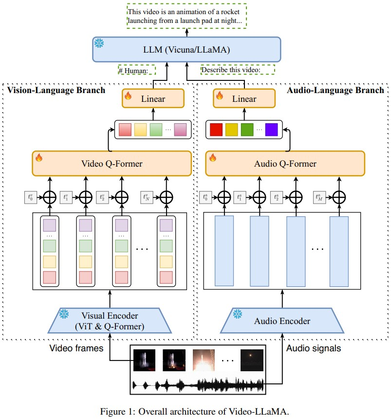

# Video-LLaMA: An Instruction-tuned Audio-Visual Language Model for Video Understanding (Alibaba)
[paper with code](https://paperswithcode.com/paper/video-llama-an-instruction-tuned-audio-visual)  

 

## Q1. 关键词
### A1. a multi-modal framework


## Q2. 文章主要思路？
### 2.1 Architecture
#### 2.1.1 Vision-Language Branch
* pre-trained visual encoder: 冻住的BLIP-2模型, 包括一个源自EVACLIP的ViT-G/14和一个预训练好的Q-former
* position embedding layer: 为了给每帧feature引入时间信息, 随机初始化
* video Q-Former: 和BLIP-2的Q-former结构相同, 随机初始化
* linear layer: 将Video Q-Former输出的video embedding vectors变换到LLM text embedding space
  
```
step1: visual encoder处理每帧图像, 得到video frame representations V = [v1, v2, ..., vN], vi=(Kf, df)
step2: 将pos_embedding作为时间信息的指示符应用于video frame representations;
step3: 将position-encoded frame representations送入Video Q-Former, 得到video embedding vectors
step4: 将video embedding vectors送入到Linear layer, 得到video query vectors
```

#### 2.1.2 Audio-Language Branch
* pre-trained audio encoder: 预训练的Imagebind模型
* position embedding layer: 与Vision-Language Branch类似
* audio Q-former: 与Vision-Language Branch类似
* linear layer: 与Vision-Language Branch类似


### 2.2 Multi-branch Cross-Modal Training
分别训练Vision-Language和Audio-Language分支. 在第一阶段，使用大规模的视觉字幕数据集进行训练，在第二阶段，使用高质量的指令跟随数据集进行微调。图像被视为一帧视频。

#### 2.2.1 Training of Vision-Language Branch
* dataset: 
    ```
    Webvid-2M: 一个大规模的短视频数据集，其文本描述来源于库存视频网站(stock footage sites)
    CC595k: 由CC3M过滤得到(LLaVA文章中创建的数据集)
    ```
* pretrain target: 视频到文本的生成任务, 即给定视频的表示, 提示冻结的LLM生成相应的文本描述
    ```
    我们发现，很大一部分的文本描述不足以反映视频的整个内容。因此，视频的视觉语义与描述中的语义信息并不完全一致。尽管如此，这一阶段的目标是利用大量的数据，并使video features包含尽可能多的visual knowledge。视觉文本对齐和指令跟随的能力留给下一个stage解决。
    ```

* instruct tuning: 
    ```
    预训练模型可以生成关于视频内容的文本，但其遵循指令的能力有所下降。因此，在第二阶段，我们使用高质量的指令数据对模型进行了微调。我们集成了MiniGPT-4的图像细节描述数据集、LLaVA的图像指令数据集和Video-Chat的视频指令数据集。经过微调，视频LLaMA在遵循指令和理解图像和视频方面表现出非凡的能力。
    ```

#### 2.2.2 Training of Audio-Language Branch
```
Audio-Language分支中可学习参数的目标是将音频编码器的输出与LLM的embedding空间对齐。由于音频文本数据的稀缺性，直接使用音频文本数据训练音频语言分支是极具挑战性的。我们采用了一种变通策略来实现这一目标。使用ImageBind作为音频编码器，它具有将不同模态的embedding对齐到一个空间的能力，在跨模态检索和生成任务上表现出了令人印象深刻的性能。我们使用视觉文本数据训练音频语言分支，遵循与视觉分支相同的数据和过程。得益于ImageBind提供的共享嵌入空间，即使音频接口从未在音频数据上进行过训练，Video-LLaMA也能在推理过程中理解音频。
```

## Q3. Limitations
* 感知能力有限：Video-LLaMA的性能受到当前训练数据集的质量和规模的阻碍。我们正在积极构建高质量的音视频文本对齐数据集，以增强模型的感知能力。
* 处理长视频的能力有限。长视频（如电影和电视节目）包含大量信息，对计算资源提出了更高的要求。这一挑战仍然是研究界正在积极努力解决的一个关键问题。
* 幻觉(Hallucination): Video-LLaMA继承了frozen LLM的幻觉问题。未来更强大的LLM有望缓解这一问题。

## Q3. 实现和结果
### A3 没有定量的指标分析, 只给出了几个例子
 