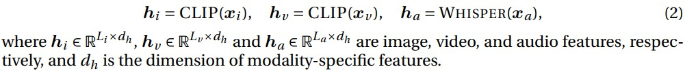
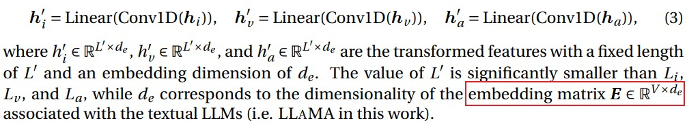
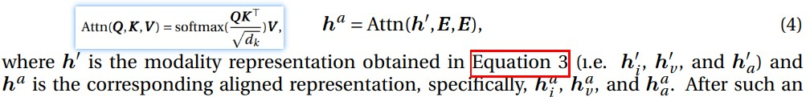
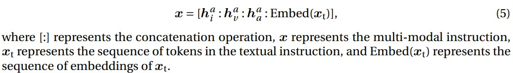

# MACAW-LLM: MULTI-MODAL LANGUAGE MODELING WITH IMAGE, AUDIO, VIDEO, AND TEXT INTEGRATION(腾讯)
[paper with code](https://paperswithcode.com/paper/macaw-llm-multi-modal-language-modeling-with)  

 

## Q1. 文章探究的问题？
### A1. 基于instruction-tuning的、集成了视觉(图像和视频)、音频和文本的多模态LLM


## Q2. 文章主要思路？
### 2.1 model
#### 2.1.1 Modality Module
* 视觉编码器: CLIP-VIT-B/16, 处理图像或者视频帧;
* 语音编码器: WHISPER;
* 文本编码器: LLaMA-7B, 或者替换更强的;

#### 2.1.2 Alignment Module
不同模态的编码器是单独训练的, 需要对齐到同一空间。步骤如下:  
1. Encoding: 使用对应的encoder处理各个模态, 获得相应的features(一组tokens序列, shape=(B,L,C));  
     
2. Transformation:  
  (1) 先使用Conv1D将序列长度压缩到更小的固定值, 是为了降低计算成本并最大限度地减少前缀中的token数量;  
  (2) 然后使用线性层调整特征维度，使其与LLM Embedding的维度对齐;  
    
3. Alignment: Transformation后的特征和LLM的embedding matrix作attention;  
    
4. Integration: concate各模态的feature以及instruction  
    

#### 2.1.3 Cognitive Module
即为文本编码器(LLaMA-7B)

### 2.2 one-step instruction fine-tuning
以往工作中常见的多模态训练涉及两步训练:
* step-1侧重于训练project层, 使多模态特征与文本特征对齐;
* step-2对LLM进行instruction-tuning;  

MACAW-LLM采用one-step instruction fine-tuning方法, 不仅简化了adaptation过程、确保了模态之间的一致性，并消除了在多步骤微调过程中可能发生的错误传播的潜在风险。  
  


## 2.3 MACAW-LLM INSTRUCTION DATASET  
用image或者video的caption、语音的transcription创建Prompt, 令GPT-4生成10对QA:  


* Image instruction dataset: 随机选取1W张带有caption的COCO图片数据, 获得了大约69K个基于COCO的样本;
* Video instruction dataset: Charades和AVSD, 总共包含9848个带字幕的视频, 获得了大约50K个基于Charades和AVSD的样本;
* Text instruction dataset:  Alpaca instruction dataset, 包括从TEXT-DAVINCI-003模型中提取的大约52000个指令响应示例;  

```
1. 目前的数据集仅支持单回合对话;  
2. 在实践中，从每种类型的指令数据中随机抽取50K个例子，并将它们组合起来，形成由150K个例子组成的最终训练数据集。注意，音频输入当前与视频指令数据相关联，并且我们正在积极地创建音频指令数据集。
```


## Q3. 实现和结果
## 3.1 实现
- 8卡A100, deepspeed
- batchsize=4, 梯度累积step=3, epoch=5, lr=3×10−5, warmup ratio=0.03, 余弦学习率衰减。
- 最大序列长度固定为512;
- FP16精度进行训练和推理;

## 3.2 结果
没有权威的测试数据集和指标

## Q4. 局限
* Evaluation: 评估方式不能准确反映MACAW-LLM的真实能力;
* Single-Turn Dialogue: 目前没有针对处理多轮对话进行优化, 可能无法有效利用长期上下文;
* Hallucination, Toxicity and Fairness: instruction-tuning可能导致Hallucination, Toxicity and Fairness的问题;


