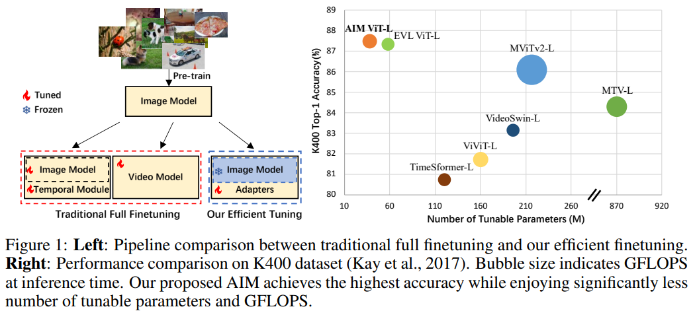
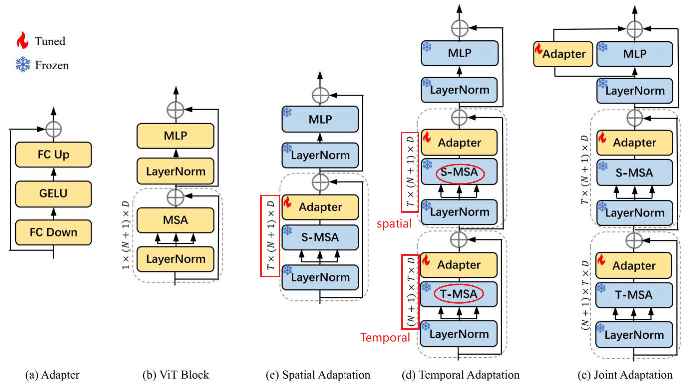

# AIM: Adapting Image Models for Efficient Video Action Recognition(ICLR2023, Amazon Web Services)
[paper](https://arxiv.org/abs/2302.03024v1)  [code](https://adapt-image-models.github.io/)

## Q1. 文章针对的问题？
### A1. 视频动作识别, pre-trained image model迁移

## Q2. 文章要验证的假设是什么？
### A2. 
(1) pre-trained image  transformer model已经被证明拥有出色的可转移性, 因此full fine tuning一个视频模型，计算代价昂贵且不必要;  
(2) 冻结预训练的图像模型，加入少量轻量级adapter，引入spatial adapter、temporal adapter和joint adapter，逐步使图像模型具备时空推理能力。  
(3) 根据(2)提出的AIM可以在四个视频动作识别基准上实现具有竞争力甚至更好的性能，且需要训练参数大大减少。由于其简单性，该方法也适用于其他的图像预训练模型，这有可能在未来利用更强大的图像基础模型。  



## Q3. 有哪些相关研究？如何归类？
### A3. 
(1) Image pre-trained models;  
(2) Video action recognition;  
(3) Parameter-efficient finetuning techniques:  
与<a href="#ref1">[1]</a>相比, 首先，他们在冻结图像编码器中添加了新的可训练的解码器分支，其中包括3D卷积和跨帧注意。我们简单地重用图像预训练的自我注意力来进行时间建模，同时享受更好的性能和更少的可调参数。其次，我们的方法被证明与不同的图像模型兼容，而Lin等人(2022)只证明了其在CLIP图像编码器上的有效性。  

## Q4. 文章的解决方案是什么？
### A4.
    

#### 4.1 adapter
由两个FC层和中间的激活层组成的瓶颈架构。第一个FC层将输入投影到一个较低的维度，后一个FC层将输入投影回原始维度. 在<a href="#ref1">[2]</a>中提出, 首先被用于NLP任务中, 后被使用到CV中;  
#### 4.2 Spatial Adaptation
在MSA之后添加了一个adapter, 使预训练的空间特征适应视频数据，在训练期间，其他层都被冻结，而只有adapter被更新。
#### 4.3 Temporal Adaptation 
为了更有效地捕获时间信息，以往的方法通常在预训练的图像模型中加入新的时间模块. 然而添加新的时间模块或者时间注意力将引入大量额外的可调参数, 并且这些新模块需要full fine tuning。  
本文提出一种新策略: reuse MSA进行时间建模。原始的MSA层表示为S-MSA, 用于空间建模; reuse MSA表示为T-MSA，用于时间建模。具体来说, 通过reshape操作使得序列长度分别为T(时间)、N+1(空间), 来实现不同维度的建模. 但是temporal adapter中没有使用skip connection, 文中说原因是想要使adapted model接近original model<sup><a href="#ref1">[2]</a></sup>, 因此需要将adapter初始化为零，并在这里删除skip connection，以在训练开始时分离temporal adapter的影响;    
#### 4.4 Joint Adaptation
一个与MLP层并行的adapter, 与temporal adapter具有相同的结构.

## Q5. 评估数据集是什么？评估方法是什么？
### A5. K400, SSV2, K700, Diving-48

## Q6. 文章的实验是怎么设计的？
### A6.
#### 6.1 comparison to state-of-the-art
  
  
  

```
在SSV2的对比实验中，AIM落后于一些full fine tuning视频模型.
一个原因是SSV2是一个“time heavy”的数据集, 需要模型真正理解视频中的时间演化。为了获得较高的精度，以往的大多数视频模型首先在一些视频数据集(如K400/K600)上进行预训练，以学习良好的时空表示，然后在SSv2上进行微调。但是AIM仅是从图像预训练模型开始的。
另一个原因是，简单地重复使用图像预训练的self-attention进行时间建模可能无法完全捕捉SSv2视频中复杂的时间信息。这表明对这些具有挑战性的“time heavy”数据集需要进行更多的temporal adaptation。
```
#### 6.2 ablation study
* different pre-trained models on K400.    
  
* data effency: 在下游数据不足的情况下, AIM更不容易出现过拟合问题  
   
* effect of position of Adapters and the bottoleneck ratio of Adapters  

* 可视化  


## 参考文献
[1] Frozen clip models are efficient video learners.  
[2] Parameter-efficient transfer learning for nlp.  