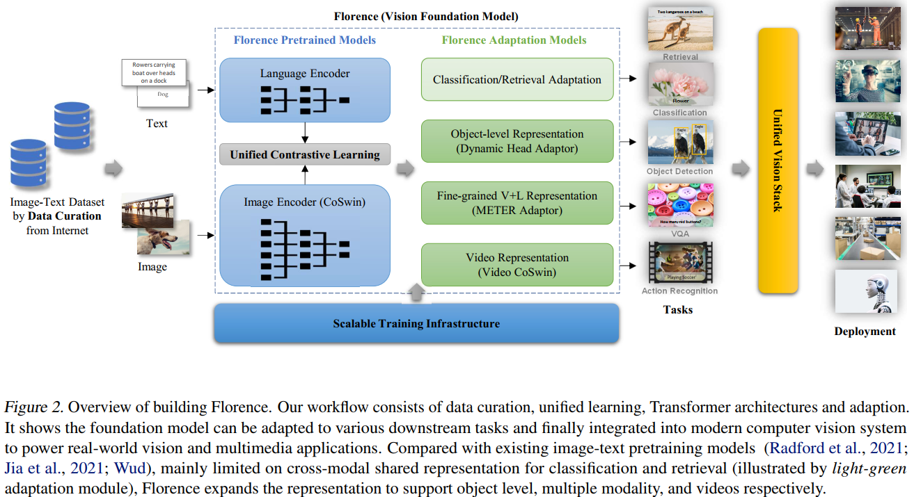

# Florence: A New Foundation Model for Computer Vision (2021, 微软)
[pdf](./Florence%20A%20New%20Foundation%20Model%20for%20Computer%20Vison.pdf)   
[paper with code](https://paperswithcode.com/paper/florence-a-new-foundation-model-for-computer)

## Q1. 论文针对的问题？
### A1. 现有的视觉基础模型仅限于图像到文本的映射任务，如classification, retrieval, and tagging, 本文提出一个新的视觉基础模型Florence:
1. 该模型可以将representations从coarse (scene)扩展到fine (object), 从static (images)扩展到dynamic (videos), 从RGB扩展到multiple modalities (caption, depth);  
2. 便于迁移到classification, retrieval, object detection, VQA, image caption, video retrieval, action recognition等任务;  
3. 在各类迁移学习中表现出色: fully sampled fine-tuning, linear probing, few-shot transfer and zero-shot transfer;  
*基础模型: 从各种大规模数据集中训练的模型, 具有很强的泛化能力, 能够有效地迁移到下游任务*

## Q2. 文章要验证的假设是什么？
### A2. **foundation model for computer vision = a pre-trained model + different adapters for all vision tasks in the Space-Time-Modality space**
1. transferability: zero-/few-shot learning and fully fine tuning, etc.
2. the adaptation for transferability is restricted to minimum customization for the pre-trained foundation models, such as continuing training, few epochs or few layers for fine tuning without significantly increasing or changing model parameters.  



## Q3. 有哪些相关研究？如何归类？
### A3. 
1. CLIP
2. ALIGN
3. Wu Dao 2.0


## Q4. 文章的解决方案是什么？
### A4. 
#### 4.1 数据集: 大规模图像-文本(FLD-900M)  
1. 来源: 互联网上公开的大量图像文本数据. 使用一个并行处理约30亿幅互联网图像及其原始描述的程序化数据管理管道，构建了一个9亿幅图像-文本对数据集;  
2. 筛选和过滤: 采用与ALIGN类似的严格数据过滤，包括简单的hash-based near-duplicate图像去除、小图像去除、图像与文本的相关性等。此外，采用<a href="#ref1">[1,2]</a>的采样策略，以实现更好的平衡性、信息性、可学习性;  
3. FLD-900M数据集: 由900M张图像和900M个自由格式文本(单词、语句、段落)、9.7M unique queries和7.5B tokens 组成;  
   
#### 4.2 pretext task: UniCL(Unified Image-Text Contrastive Learning):  
1. CLIP的问题: CLIP假设每个图像-文本对都有其唯一的caption，其他caption被视为负样本。然而，在网络规模的数据中，多个图像可以具有相同的caption。例如，在FLD-900M中，有350M个图像-文本对是多个图像对应于一个相同的文本。在对比学习中，与同一文本相关联的所有图像都可以被视为正样本;  
2. UniCL<sup><a href="#ref1">[3]</a></sup>: Florence is pre-trained in an image-label-description space
   * 给定一个image-text pair, 通过文本哈希表生成一个三元组(x, t, y)
   ```
   x: 图像
   t: 文本描述(hash value)
   y: 文本标签(hash key), the index of unique language description in the dataset;
   (1) 相同的文本描述会映射到相同的文本标签(hash key);
   (2) 映射到同一标签y的所有图像-文本对都被认为是正例, 其他的为负例;
   (3) 上述过程近似等价地统一了监督学习(相同的文本描述等价于标签)和对比学习(学习目标依然是不同的representation);
   ```
   * 数据增强：内容丰富的long language descriptions比short更有利于图像文本表征学习, 因此需要构建prompt templates来丰富short language descriptions;
   ```
   prompt templates, 例如“A photo of the [WORD]”, “A cropped photo of [WORD]”, 用于作为数据增强;
   训练过程随机选择一个prompt template来丰富short language descriptions, 并生成最终的t;
   ```
   * 损失函数: 简单来说相比于CLIP, 除了拉近相似度对角线上的value, 还应拉近同标签的其他点(图中yk=yi, yk=yj);  
   
   * 训练策略: prompt并不精确, 不如真实描述有信息, 可能会影响图像检索或者视觉语言任务的准确性, 因此训练中分为两个阶段  
   (1) stage1: 使用包括增强文本在内的所有数据进行训练(1M iterations);  
   (2) stage2: 去除增强文本后继续训练(180K iterations);  
   (3) img-size=224x224, 文本描述长度<=76, batchsize=24576, 还以img-size=384x384进一步训练了80K iterations来提升性能;

#### 4.3 模型: 双塔结构
1. text encoder: 12层Transformer, 类似CLIP. 256M parameters;
2. visual encoder: 分层ViT(如Swin, CvT, FocalTransformer, CSwin等), 层次结构可以建模图像尺度不变性，只有线性复杂度，对于密集预测任务（如对象检测和分割）至关重要。文章使用的是CoSwin-Transformer, 将原有的Swin-Transformer中的patch embedding和patch merging替换为卷积(CvT的做法), 方便扩展到视频输入. 893M parameters;
3. projection layer: 对齐两个模态的输出维度;
4. takes 10 days to train on 512 NVIDIA-A100 GPUs with 40GB memory per GPU.

#### 4.4 Object-level Visual Representation Learning
1. adapter: Dynamic Head<sup><a href="#ref1">[4]</a></sup> or Dynamic DETR<sup><a href="#ref1">[5]</a></sup>:
2. dataset: FLOD-9M(FLorence Object detection Dataset) for object detection pre-training, including COCO, LVIS, OpenImages, Object365, ImageNet-22K(generate pseudo bounding boxes). FLOD-9M consists of 8967286 images, 25190 object categories, and 33408237 bounding boxes including annotations and pseudo labels.  
3. object detection pre-training: pre-train Dynamic Head model for 12 epochs with batch size 128, which takes 7 days on 128 NVIDIA-A100 GPUs.  

#### 4.5 Fine-Grained V+L Representation Learning(细粒度视觉语言表征学习)
1. adapter: METER<sup><a href="#ref1">[6]</a></sup>


## Q5. 评估数据集是什么？评估方法是什么？
### A5. 

## Q6. 文章的实验是怎么设计的？
### A6. 


## Q7. 实验方法和结果能不能支持文章提出的假设？
### A7. 

## Q8. 文章的主要贡献是什么？
### A8. 

## Q9. 是否存在不足或者问题？
### A9. 


## Q10. 下一步还可以继续的研究方向是什么？  
### A10. 


## **提到的参考文献**
[1] Radford, A., Kim, J. W., Hallacy, C., Ramesh, A., Goh, G., Agarwal, S., Sastry, G., Askell, A., Mishkin, P., Clark, J., Krueger, G., and Sutskever, I. Learning transferable visual models from natural language supervision. In arXiv 2103.00020, 2021.  
[2] Ramesh, A., Pavlov, M., Goh, G., Gray, S., Voss, C., Radford, A., Chen, M., and Sutskever, I. Zero-shot text-toimage generation. In arXiv 2102.12092, 2021.  
[3] Yang, J., Li, C., Zhang, P., Xiao, B., Liu, C., Yuan, L., and Gao, J. Unified contrastive learning in image-text-label space. In arXiv In Preparation, 2022.  
[4] Dai, X., Chen, Y., Xiao, B., Chen, D., Liu, M., Yuan, L., and Zhang, L. Dynamic head: Unifying object detection heads with attentions. In Proceedings of the IEEE/CVF Conference on Computer Vision and Pattern Recognition (CVPR), pp. 7373–7382, June 2021a.  
[5] Dai, X., Chen, Y., Yang, J., Zhang, P., Yuan, L., and Zhang,
L. Dynamic detr: End-to-end object detection with dynamic attention. In Proceedings of the IEEE/CVF International Conference on Computer Vision (ICCV), pp.
2988–2997, October 2021b
[6] Dou, Z.-Y., Xu, Y., Gan, Z., Wang, J., Wang, S., Wang, L.,
Zhu, C., Nanyun, Peng, Liu, Z., and Zeng, M. An empirical study of training end-to-end vision-and-language
transformers. In arXiv 2111.02387, 2021.