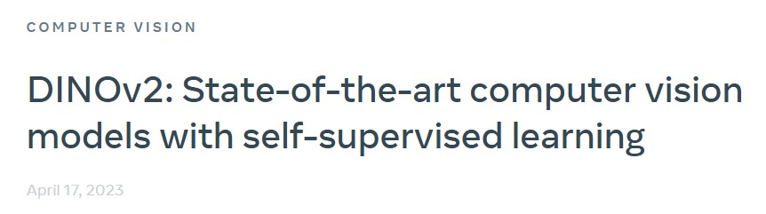

# DINOv2: Learning Robust Visual Features without Supervision(2023, Meta)
 

[[paper with code]](https://paperswithcode.com/paper/dinov2-learning-robust-visual-features) [[demo]](https://dinov2.metademolab.com/)  

### ***keywords***
* 一系列image encoder;
* 自监督训练, 直接从图像中学习特征而不依赖文本描述;
* 高质量的图像特征, 强大的性能甚至不需要在下游任务上微调backbone;
* 142M图像数据集(LVD-142M, 未开源);
* 训练的稳定性和加速;

## 1. 数据pipeline

 

### 1.1 data source
* Curated Data: 公开数据集;  
* Uncurated Date: 爬取的网络数据, 经过PCA hash去重、NSFW过滤、模糊可识别人脸后共得到1.2B数据;

### 1.2 去重
方法来自于文章"A self-supervised descriptor for image copy detection."

### 1.3 自监督图像检索
1. 用在ImageNet-22k上自监督预训练的ViT-H/16计算embedding, 用余弦相似度作为距离度量;
2. 对Uncurated Date进行k-means聚类;
3. 如果query dataset足够大, 则给每个query image检索N(一般是4)个近邻;
4. 如果query dataset比较小, 则从query image对应的聚类中采样M个图像;
5. adjust N and M by visual inspection of the retrieval result.

### 1.4 实现细节
1. 使用Faiss库加速;
2. 集群: 20 nodes equipped with 8 V100-32GB GPUs;


## 2. 自监督预训练(Discriminative Self-supervised Pre-training)
**a combination of DINO and iBOT losses with the centering of SwAV**

### 2.1 Image-level objective
* 计算teacher网络和student网络得到features的交叉熵loss;
* features即是ViT的class token(obtained from different crops of the same image)
* student网络的参数是学习得到的;
* teacher网络的参数通过滑动指数平均结算得到;

### 2.2 Patch-level objective
* student网络的输入作随机的mask, teacher网络的输入不mask;
* 计算mask patch部分的交叉熵loss;(让student学习到mask patch和其他部分的联系？)

### 2.3 Untying head weights between both objectives.
两个objective的使用同一个head weights会使模型在Patch-level上不足，而在Image-level上过拟合。
因此需要将两个head解耦来解决这个问题，并提高两种scale上的性能。

### 2.4 Sinkhorn-Knopp centering
* 提出用SwAV中的Sinkhorn-Knopp batch normalization替代DINO和iBot中teacher softmax-centering step;  
  (softmax-centering 步骤在某些情况下可能导致不稳定性, SK通过正则化来使学生和教师网络在特征表示上更加接近)
* 本文使用3次Sinkhorn-Knopp算法迭代实现归一化, 对于student则仍然使用softmax normalization.

### 2.5 KoLeo regularizer
使用了一种名为Kozachenko-Leonenko差分熵估计的技术(一种估计随机样本密度的方法). 这个正则化器的作用是减少特征向量之间的差异，从而使它们在整个batch内均匀分布。(特征向量会先进行L2 norm)

### 2.6 Adapting the resolution
这一步主要是涉及在预训练的最后阶段，将图像的分辨率提高到518×518, 以便在下游任务中更好地处理像素级别的信息, 例如分割或检测任务。  
高分辨率的图像通常需要更多的计算资源和存储空间，因此只在预训练的最后阶段使用这种方法，以减少时间和资源成本。

## 3. 高效的实现
PyTorch 2.0 + A100 GPU
1. 快速且省内存的attention: FlashAttention;  
   ```
   由于GPU硬件的特殊性，当每个head的embed dims是64的倍数时，效率是最好的，而当整个embed dims是256的倍数时矩阵运算甚至更好.
   因此, 本文的ViT-g架构为embed dims=1536, head=24(64 dim/head), 而不是原始结构不同的embed dims=1408, head=16(88 dim/head).
   实验结果表明，最终的准确率没有显著差异.
   ```
2. Nested tensors in self-attention. 
   为了提高计算效率，本文实现了一个可以在同一个前向传递中运行全局裁剪和局部裁剪（token数量不同）的版本，这种实现与之前的实现相比具有更好的计算效率。此外，还使用了xFormers 库的一些低级组件。

3. 高效的随机深度(Efficient stochastic depth)
   在传统的stochastic depth方法中, 由于每个残差块在训练过程中可能会随机丢弃，因此需要在前向计算时对每个残差块的输出进行mask以确保正确性。而DINOv2实现了一种改进版本, 跳过被丢弃的残差的计算，而不是对结果进行mask。这样可以节省内存和计算资源，并且在高丢弃率(d=0.4)下具有更好的计算效率和内存使用率。具体的实现方式包括在batch维度上随机打乱B个样本, 并将前(1-d)×B个样本用于block的计算。
   ```
   在跳过时block内不会进行计算, 只有identity shortcut
   ```

4. 完全共享的数据并行(FSDP)
   FSDP技术的作用是使训练过程可以更加高效地扩展至多个GPU节点。具体地，在使用AdamW优化器进行训练时，需要使用4个模型副本，包括 student, teacher, optimizer的一阶和二阶动量, 对于一个类似于ViT-g这样动不动10亿参数的模型, 意味着至少需要16GB的内存。因此，为了降低每个 GPU 的内存占用，作者使用FSDP技术，将模型副本分片放置在多个GPU上。如此一来，模型大小不再受单个GPU的内存限制，而是受到整个计算节点的GPU内存总和的限制。  
   
   FSDP 还具有第二个优点，即可以节省跨GPU通信成本，因为权重分片存储在float32 精度中，而广播权重和减小梯度则使用float16 精度进行计算。与其他自监督预训练方法中使用的 float32 gradient all-reduce operation相比，这样做可以将通信成本降低约50%。因此，与DDP和float16自动类型转换相比，Pytorch-FSDP混合精度在几乎所有情况下都更加优越。

   ```
   Gradient AllReduce 是在分布式深度学习中，一种将梯度从不同 GPU 节点上的模型参数收集和组合成单个梯度张量的操作。通常，在使用梯度下降算法时，需要将所有 GPU 节点的梯度合并成单个梯度张量，以更新模型参数。此操作便是实现这一目的的一种并行算法，可以提高模型训练的速度和效率。
   ```

5. 模型蒸馏
   使用一个更大的模型作为冻结的教师模型，保留学生模型的EMA作为最终模型，并且去掉了mask和随机深度，并将iBOT损失应用于两个global crops。

## 4. 消融实验

### 4.1 训练策略带来的提升
 

```
作者说, LayerScale和Stochastic Depth会导致linear prob的精度下降, 但是会显著提升训练的稳定性
```

### 4.2 预训练数据
 

```
1.模型是ViT-g/14.
2.INet-22k\INet-1k表示从INet-22k中去除相同类别;
3.uncurated表示与LVD-142M相同的数据源随机采样1.42亿张图像;
```

### 4.3 不同scale模型在数据集上的效果
 

```
大模型(ViT-g)在LVD-142M上预训练会比在ImageNet-22k上好, 但是"小"模型(ViT-L/H)在LVD-142M上预训练其实没有明显优势;
```

### 4.4 KoLeo loss和MIM任务的重要性
 

### 4.5 知识蒸馏比直接预训练"小"模型更好
 

### 4.6 高分辨率预训练的模型效果最好但是开销大, 先低后高的策略在精度和开销上都是可以接受的
 

## 5. 对比实验
### 5.1 ImageNet Classification
 

 

 

### 5.2 其他图像/视频分类任务
  

  

### 5.3 Instance Recognition
  

### 5.4 密集预测任务

#### 5.4.1 语义分割
  

#### 5.4.2 深度估计
  


## 6. 总结与展望
1. 文章主要是思路是通过自监督预训练获得一个可以和弱监督方法(e.g. CLIP)相媲美(甚至更好)的CV基础模型;
2. 文章的主要对比是在linear prob上, 想要证明DINOv2的feature有很好的performance, 可以跨域泛化、可以不用微调;
3. 从视频分类的结果上看, 在K400和SSv2上的精度距离监督训练还是差的比较远, 由于文章没有更多的去比较finetuning后的结果, 所以无法得知finetuning后能否达到SOTA或接近的效果, 亦或者time module的设计是不可或缺的;


## **相关文献**
[1] Ed Pizzi, Sreya Dutta Roy, Sugosh Nagavara Ravindra, Priya Goyal, and Matthijs Douze. A self-supervised
descriptor for image copy detection. arXiv preprint arXiv:2202.10261, 2022.  
[2] Yangjun Ruan, Saurabh Singh, Warren Morningstar, Alexander A Alemi, Sergey Ioffe, Ian Fischer, and
Joshua V Dillon. Weighted ensemble self-supervised learning. arXiv preprint arXiv:2211.09981, 2022.
