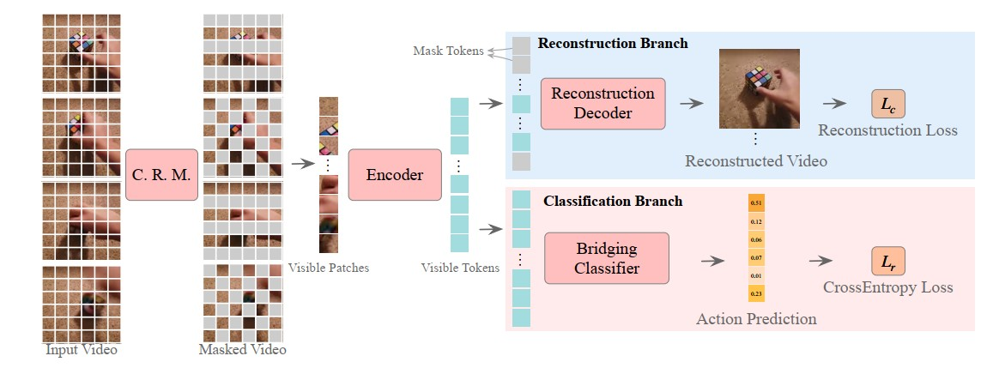

# MAR(2022, 阿里)
[paper with code](https://paperswithcode.com/paper/mar-masked-autoencoders-for-efficient-action)  

## Q1. 文章探究的问题？
### A1. 在下游动作识别任务中, 所有token仍然被送编码器中, 尤其是对于具有1568个令牌的video clip，这显然造成了沉重的计算负担。


## Q2. 文章的前提假设？
### A2. 
(1) 视频中普遍存在时空冗余, 标准方法通常对全输入视频进行操作, 因此效率低下;  
(2) VideoMAE的成功说明了视频数据的两个关键特征，即时间冗余和时间相关性。
  * 前者意味着语义在时间维度上变化缓慢，时空信息高度冗余，这表明保留所有token用于训练和推理是低效和不必要的.
  * 后者强调相邻帧之间的强内在相关性，这可能导致帧之间的“信息泄漏”，从而降低VideoMAE的重建难度。因此，视频重建任务，需要90%的mask ratio, 而预训练模型仍然可以获得令人满意的重建效果, 这显示了ViTs强大的时空关联能力。
  
## Q3. 文章的解决方案是什么？
### 3.1 Abstract
既然视频输入的时空冗余很大, VideoMAE重建的效果又不错, 那么不把所有的token给到encoder, 信息也是够用的;
1. 在输入时通过mask掉50%的tokens来降低运算量;
2. 用两个分支来解码, Reconstruction Branch实际上就是VideoMAE, 在推理的时候会去掉, Classification Branch就是最终用来做动作识别的分支。

     

### 3.2 Cell Running Masking
* 原因: 既然不把所有的token送到encoder, 那必然要设计一种mask方式(显然random的方式时不合适的, random mask无法保证保留足够的时空关联信息, 而且在推理时明显会造成精度浮动);  
* 方案: Running Cell Masking  
        
    

### 3.3 Bridging Classifier
mask 50% 的识别精度肯定是会比没有mask要弱的(FLIP的实验里也类似的结论), 作者认为在MAR中重构效果是令人满意的，这证明了特征中的低级语义信息是足够的，所以分类精度弱实际上是因为线性分类器无法充分利用低级语义信息
```
MAE提到，像素级重建和识别任务需要不同抽象级别的latent representation, 具体来说，具有更高级语义的表示可以带来更好的识别精度，但不专门用于重建。
```
因此作者设计了一个Bridging Classifier + average pooling 取代全连接层。

```
we propose bridging classifier, consisting of a series of transformer blocks like the reconstruction decoder, 
to bridge the semantic gaps between the encoded features and the classification features
```

## Q4. 在下游任务上的效果
### 4.1 消融实验
实验设置: ViT-B, 16 frames, SSv2
1. 不同mask策略的影响: running cell最好, 即使mask ratio=75%也有着不错的精度    
  

2. cell尺寸的影响: 2*2最好  
  

3. cell拼接方式、起始状态的影响, 不同ratio的交叉验证  
  

4. 识别准确率和重建损失之间的相关性(mask ratio=50%): 重建损失越低、识别率越高   
  

5. Bridging Classifier的消融：  
  - Bridging classifier比全连接层好  
     
  
  - 增加Pos.Emb.或者Masked Tokens没有好处, 也说明了分类任务所需的高级语义并不强烈依赖于这两个因素  
    

6. 重建的目标(像素值)有没有归一化、decoder有没有用VideoMAE Pre-trained：  
  

7. 重建loss的权重、encoder权重的预训练数据集、数据增强方式、训练耗时  
     
  
### 4.2 对比试验
   

  
