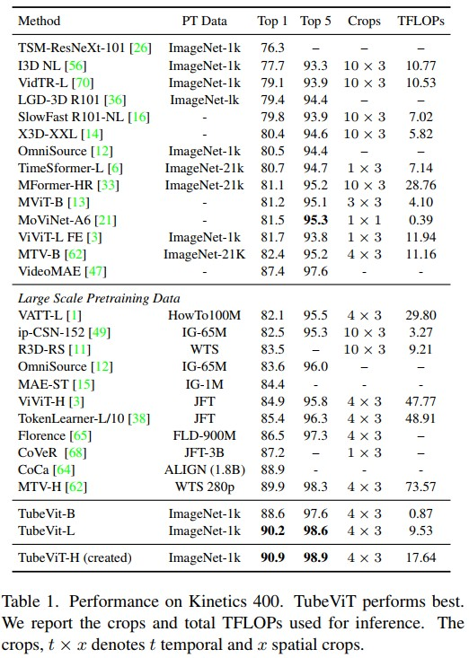
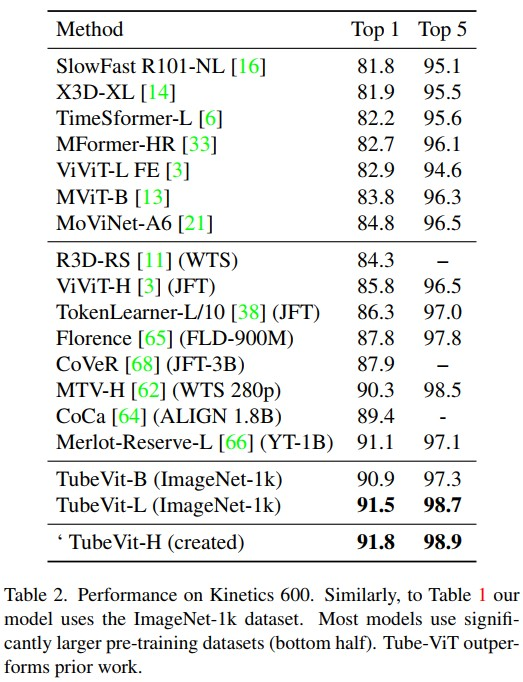

# TubeViT(2022, google research)
[paper with code](https://paperswithcode.com/paper/rethinking-video-vits-sparse-video-tubes-for)    
***官方暂未开源代码***  
  


## Q1. 文章探究的问题？
### A1. 图像-视频联合学习、更有效率的视频学习

 
## Q2. 文章的解决方案是什么？
  

### 3.1 Sparse Video Tubes
所谓稀疏的Tubes, 就是不同(T, H, W)的patch. 在代码上通过不同kernel、stride、shift的Conv3D来实现. 以(3, 32, 224, 224)的输入为例:  
* k=1×16×16×d, s=(32, 16, 16), shift=(0,0,0), 将产生1x14x14=196个tokens, 也即是通常image的tokenize方式;
* k=8×8×8×d, s=(16, 32, 32), shift=(0,0,0), 将产生2x7x7=98个tokens;
* k=16×4×4×d, s=(6, 32, 32), shift=(4,8,8), 将产生3x7x7=147个tokens;
* k=4×12x12×d, s=(16, 32, 32), shift=(0,16,16), 将产生2x7x7=98个tokens;
  
四种不同的tubes一共产生539个token(p.s. 文章中写的是559, 非官方的实现中是539)
可以看出来, 不同的patch之间是存在重叠的;   

```
文章探究了几种创建视觉tube的方法:
(1) Multi-Tube: 不同尺寸的kernel;
(2) Space-to-Depth: 
(3) Interpolated Kernels: 不为每个tube单独设置卷积核，而是从一个8×8×8的卷积核开始学习。使用三线性插值将卷积核变换到到不同的大小，例如4x16x16或32x4x4;
```

### 3.2 Positional embedding for sparse video tubes
* 原因: 可学习的位置编码不一定反映出patch在原始视频中的位置，特别是在patch重叠的情况下;
* 方案: 文章使用固定的正弦/余弦嵌入。用tube的中心位置(x, y, t)计算正弦/余弦嵌入, 确保每个patch和tube的位置嵌入具有全局时空位置。   
    
    

### 3.3 Image and Video Joint Training
```
the image is tokenized by the 2D kernel and 
the video is tokenized by both the 2D patches (with large temporal stride) and Sparse Tubes. 
Both are then passed into a standard ViT.
```

***这里的问题是作者没有具体说怎么进行联合训练, 显然image对应的是196 tokens, 远小于视频token数, 把图像重复了32帧？还是把图像和视频分开迭代？***

### 3.4 Image-To-Video Scaling Up of Models


## Q4. 在下游任务上的效果
### 4.1 对比试验
  


### 4.2 消融实验
1. 联合训练效果更好  
  
  

2. model scaling  
  


3. 太多的token会伤害精度  
  

4. 消融   
     

  

