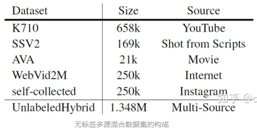

# VideoMAEv2(2023, 南京大学&上海AI Lab)
[paper with code](https://paperswithcode.com/paper/videomae-v2-scaling-video-masked-autoencoders)  

## Q1. 文章探究的问题？
### A1. 视频基础模型预训练, 提高VideoMAE的扩展性
(1) 扩展VideoMAE会导致高昂的计算开销和显存占用，在现有硬件上难以承受;  
(2) 掩码自编码预训练方法依然需要大量数据来减小训练大模型时的过拟合风险，但已有的公开视频数据集比较小;  
(3) 如何充分释放十亿参数级别的预训练大模型的性能。


## Q4. 文章的解决方案是什么？
### 4.1 Abstract
    

     

### 4.2 双掩码策略
* 原因: VideoMAE的decoder是预测所有的tokens, 对于训练来说就会占用比较大的显存、增加训练时长;  
* 方案: VideoMAEv2的目的是减少预测的token数量来降低显存占用和减少训练时长(原理就是认为视频的冗余性，即便减少预测的tokens也能保证效果)。
* 实现:   
    (1) decoder部分也增加了一个mask, 通过mask来控制哪些token最终用来计算loss(4.1 Abstract中图2的Decoder masking, 红色部分即为参与计算loss的token)。这样需要解码的token数量就降低了一半(100%->50%);  
      ```
      class PretrainVisionTransformer(nn.Module):
         def forward(self, x, mask, decode_mask=None):
            decode_vis = mask if decode_mask is None else ~decode_mask  # 如果没有设置decode_mask, 就预测mask的那部分token

            x_vis = self.encoder(x, mask)  # [B, N_vis, C_e]
            x_vis = self.encoder_to_decoder(x_vis)  # [B, N_vis, C_d]
            B, N_vis, C = x_vis.shape

            # we don't unshuffle the correct visible token order,
            # but shuffle the pos embedding accorddingly.
            expand_pos_embed = self.pos_embed.expand(B, -1, -1).type_as(x).to(
                  x.device).clone().detach()
            pos_emd_vis = expand_pos_embed[~mask].reshape(B, -1, C)
            pos_emd_mask = expand_pos_embed[decode_vis].reshape(B, -1, C)  # 需要预测的token的position embedding

            '''
            1. transformer不关心token的顺序, token的空间信息是由pos_emd提供, 所以可以直接拼接;
            2. self.mask_token.size = (1, 1, embed_dim), 自动广播到pos_emd_mask相同shape
            '''
            # [B, N, C_d]
            x_full = torch.cat(
                  [x_vis + pos_emd_vis, self.mask_token + pos_emd_mask], dim=1)  


            # NOTE: if N_mask==0, the shape of x is [B, N_mask, 3 * 16 * 16]
            x = self.decoder(x_full, pos_emd_mask.shape[1])  # decoder就是MHSA结构, 返回的就是self.mask_token + pos_emd_mask那部分的token

            return x
      ```
    (2) decode mask的生成方式: 作者对比了原始VideoMAE、frame mask、random mask和running cell mask. 如下表所示, 采用running cell并只重建编码器不可见的视频块时，即使掩码比率提高到75%，也能保持优异的性能;

      

      ```
      所谓running cell, 其实就是[1, 1, 0, 0]在做循环移位, 比如[1, 1, 0, 0]向左移位的下一个状态为[1, 0, 0, 1].
      1. 将[0, 1, 1, 0]reshape到[[0, 1], [1, 0]], 并在H、W方向上repeat, 就是4.1 Abstract中图2的Decoder masking最外侧的mask图;
      2. 把[0, 1, 1, 0]循环移位成[1, 1, 0, 0], 重复1的操作就是第二帧的mask图;
      3. 重复上述操作来生成所有T帧的mask.
      ```   
    (3) 双掩码在显存和速度上的提升:     
     

### 4.3 Scaling VideoMAE
4.2使用双掩码策略来降低显存占用和减少训练时长, 目的就是为了能够训练更大的模型。
* Model scaling: 编码器从ViT-B, ViT-L, ViT-H到ViT-g, 解码器的深度和宽度则分别控制在4和512以减少计算开销;
* Data scaling:   
  

### 4.4 渐进式训练
* 原因：预训练模型学到了某些不变性特征，为参数空间提供一个有利的初始化，但模型也需要更高语义的监督来释放性能。原始的VideoMAE只在对应数据集上微调模型，监督信号比较受限。直接迁移可能无法充分释放大模型的性能。为了更好地适应下游任务，需要确定一个合适的迁移方案。
* 方案：作者采用了一种渐进式的训练范式，降低模型过拟合风险的同时，充分释放其潜在性能。
  - 首先, 在无标签多源视频数据集上进行自监督预训练(Pre-training);
  - 然后, 合并多个公开的带标签监督视频数据集来建立一个带标签的混合数据集(K710)，并在该数据集上对模型进行有监督的后预训练微调(Post-pre-training);
  - 最后，在目标数据集上进行专门微调(Specific Fine-tuning)，使模型迁移到以该任务为中心的域中。
* 效果: 增加了extra supervision后, VideoMAEV2精度从86.9(83.2)提升到了88.6(85.0), VideoMAEV2精度从86.6提升到了88.1(84.6)。但是作者也提到post-pre-training的方式在SSV2上起到了反作用, 所以可能还是K710和K400同域带来的提升, 和SSV2存在域差异反而会损失精度;  
    
  

## 5. 在下游任务上的效果
  
  